# Bài 1: Thiết lập STM32 và môi trường KeilC

[**Slide**](https://docs.google.com/presentation/d/1CnlZGsxQnjm5E3cadukwCdzROKxm70Y3u_0EjlHvJLg/edit#slide=id.g2f3ab462d15_0_2)


## 1. Tạo Project 

- Project -> New uVision Project -> Chọn Folder lưu Project

- Chọn vi điều khiển là STM32F103C8T6

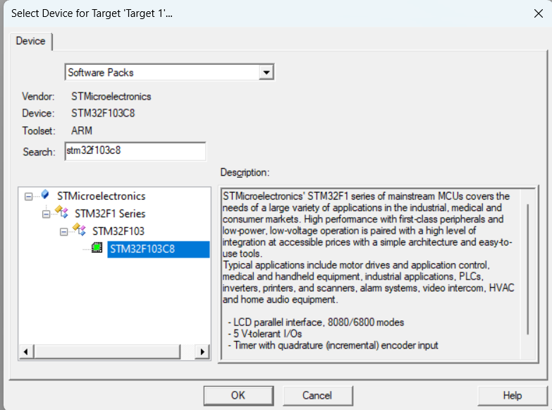

- Ở Manage Run - Time Environment, chọn 1 số file cần thiết. Bài này chỉ Input Ouput

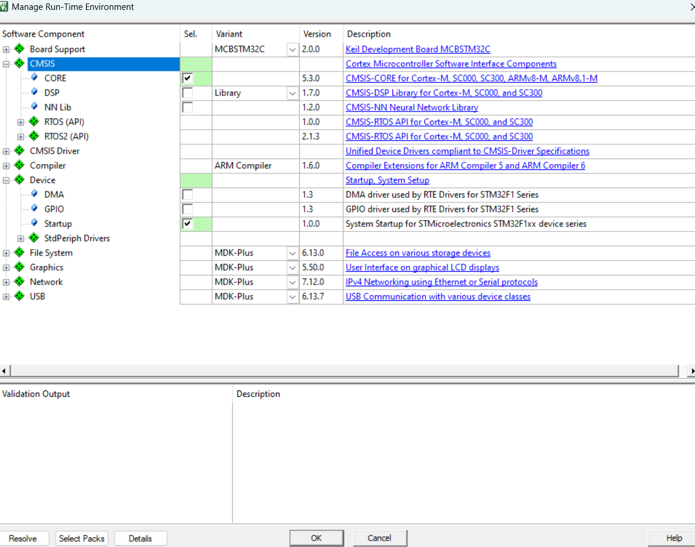

- Nhấn chuột phải vào Sourrce Group -> add file .c

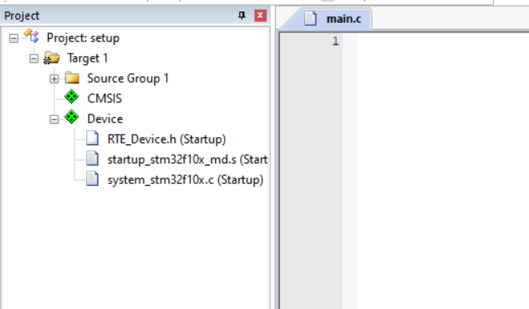

- Tạo file lần đầu -> bấm rebuild để build tất cả các file trong Project

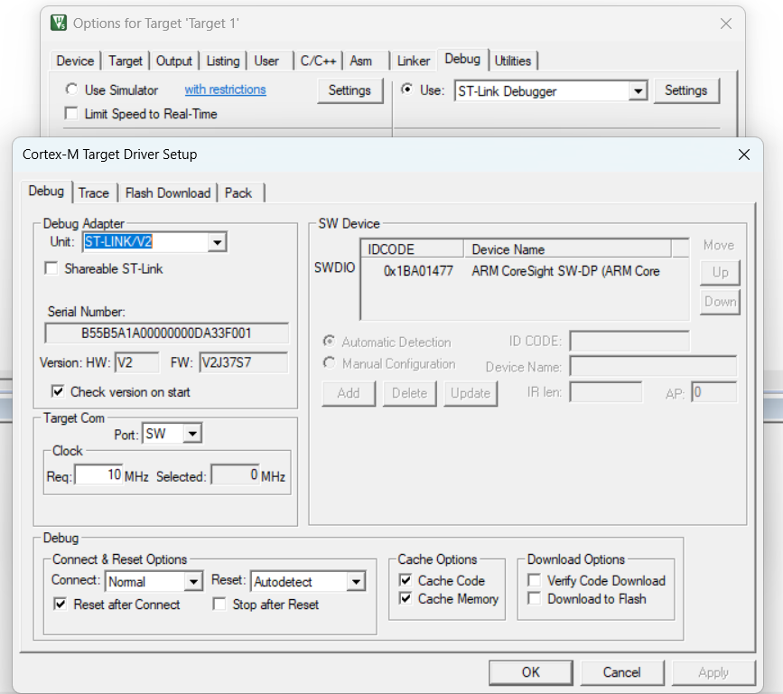

- Setting Debug, đã kết nối và nhận diện được STM32 & ST-link V2

## 2. Blink LED PC13 

**Gồm 3 bước**:

- Cấp xung clock cho ngoại vi

- Cấu hình chân 

- Sử dụng

### 2.1. Định địa chỉ thanh ghi cần sử dụng

Trong kiến trúc vi xử lý hoặc vi điều khiển, các thanh ghi được ánh xạ vào không gian bộ nhớ. Địa chỉ của một thanh ghi được xác định trong phạm vi cụ thể, gọi là register boundary address.

- **Register Start Address**: Địa chỉ bắt đầu của một thanh ghi hoặc tập hợp thanh ghi.

- **Register End Address**: Địa chỉ kết thúc của vùng thanh ghi.

- **Register Boundary**: Điểm đánh dấu biên giới giữa các thanh ghi liền kề.

- Phạm vi của thanh ghi cho ngoại vi **Clock control RCC**

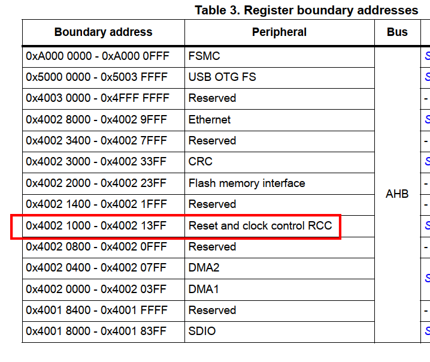

*Muốn làm việc với thanh ghi nào trong RCC, lấy địa chỉ gốc + offset tương ứng*

### 2.3. Cấp clock cho ngoại vi

- PC13 nằm trong **GPIOC** -> được cấp clock thông qua đường bus **APB2**


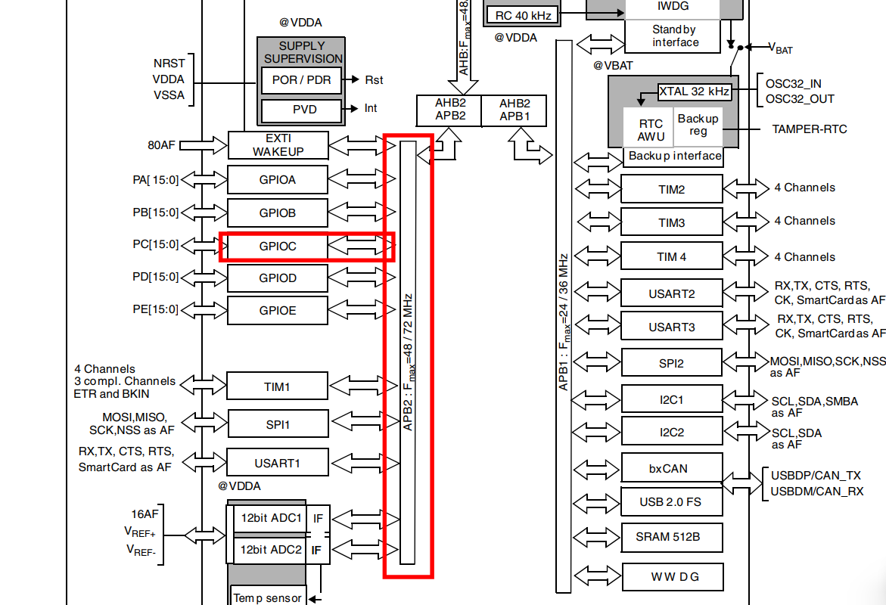

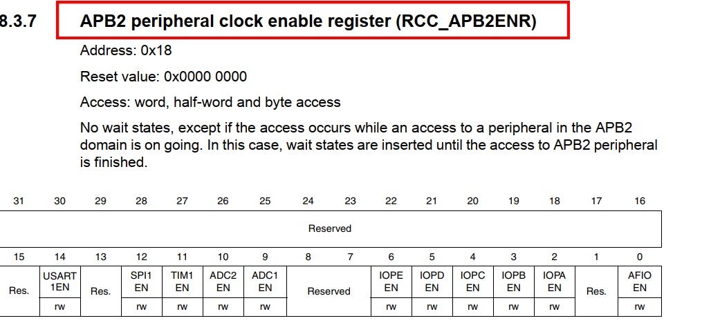

- Định nghĩa thanh ghi **RCC_APB2ENR = Register Start Address + offset = 0x40021018**

`#define RCC_APB2ENR	*((unsigned int *)0x40021018)`

- Dereference: làm việc với giá trị mà địa chỉ đó chứa

- Ép kiểu thành số nguyên 32 bit không dấu


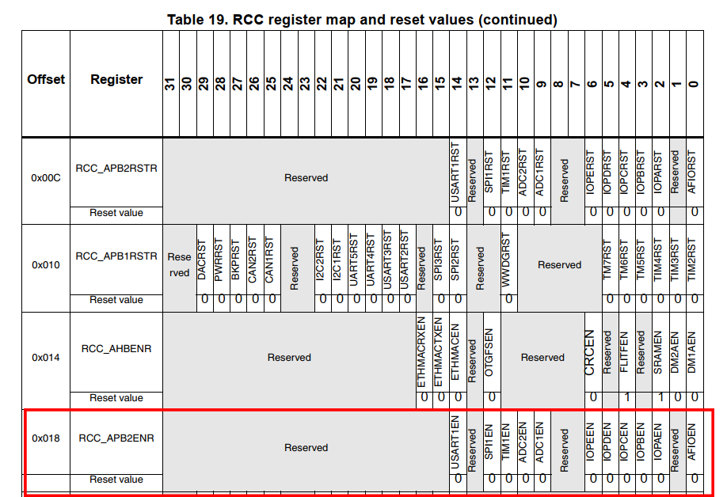

- Sử dụng kĩ thuật bitmask (OR) để bật bit lên 1 cần mà không ảnh hưởng đến các bit trước đó

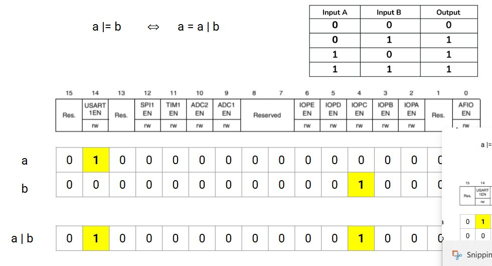

**=> Bật bit 4 lên 1 (GPIOC) trong ABP2**

`RCC_APB2ENR |= (1 << 4); // Kich hoat xung clock cap cho GPIOC`

### 2.2. Cấu hình cho chân PC13

- 2 thanh ghi cấu hình chế độ cho chân GPIO: **CRL, CRH**

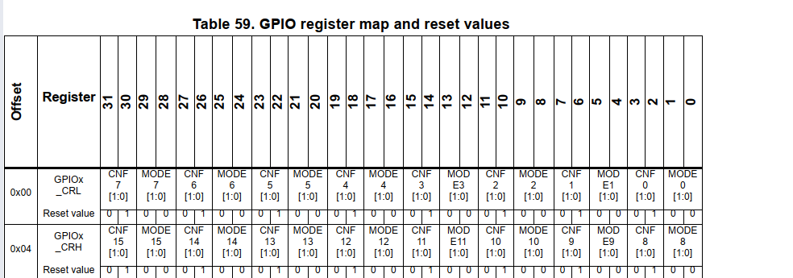

- Cấu hình chân PC13 là ngõ ra

- Chế độ chân (đối với cấu hình là output): push-pull (1/0), open-drain(0/ lơ lửng), cấu hình CNF13 & MODE13

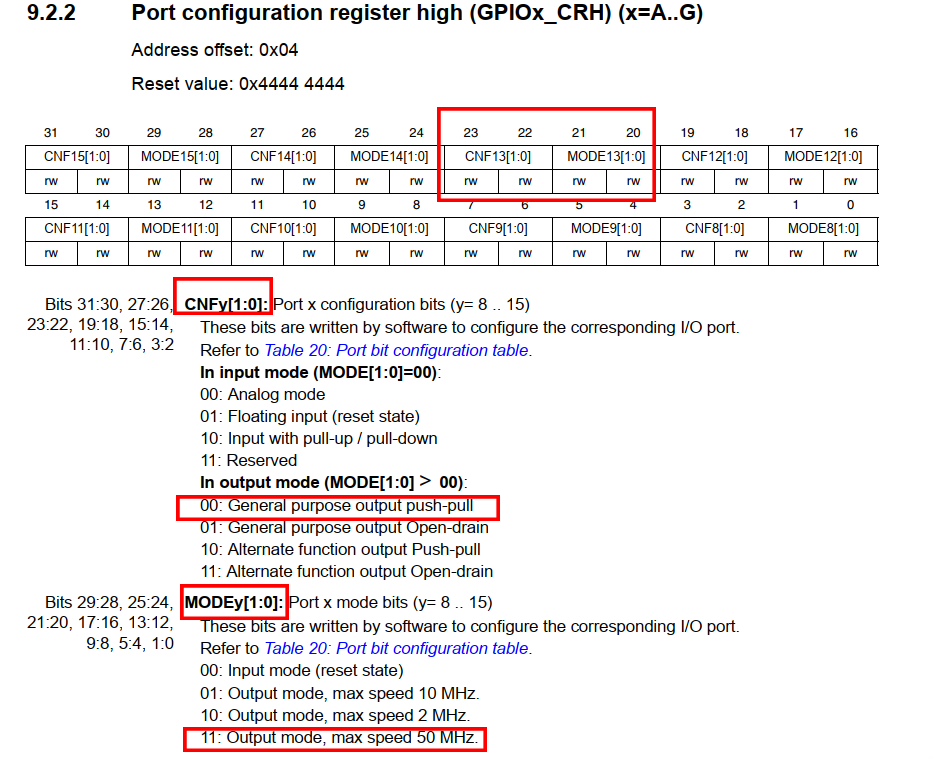

- Tương tự, ta define địa chỉ cho **GPIOC_CRH** là 


`#define GPIOC_CRH		*((unsigned int *)0x40011004)`

- Bitmask &~ để đưa bit xuống 0 mà không ảnh hưởng các bit trước đó

```c
// MODE13[1:0] = 11: Output mode, max speed 50 MHz	
GPIOC_CRH |= (1 << 20) | (1 << 21);

// CNF13[1:0] = 00: General purpose output push-pull
GPIOC_CRH &= ~((1 << 22) | (1 << 23));

```

- Thanh ghi **GPIO_ODR** sử dụng để điều khiển tín hiệu điện áp của 1 chân

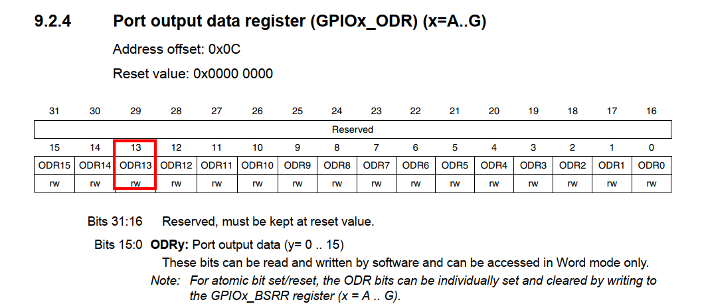

- Tương tự, define địa chỉ cho **GPIOC_ODR** 

`#define GPIOC_ODR *(unsigned int *)0x4001100C`

- Tạo hàm delay & code hoàn chỉnh

```c
#define RCC_APB2ENR  *((unsigned int *)0x40021018)
#define GPIOC_CRH    *((unsigned int *)0x40011004)
#define GPIOC_ODR    *((unsigned int *)0x4001100C)

void delay(unsigned int time) {
    for (unsigned int i = 0; i < time; i++);
}

int main() {
    RCC_APB2ENR |= (1 << 4);  
    GPIOC_CRH &= ~((1 << 23) | (1 << 22));  
    GPIOC_CRH |= ((1 << 21) | (1 << 20));  

    while (1) {
        GPIOC_ODR |= (1 << 13);  
        delay(10000000);
        GPIOC_ODR &= ~(1 << 13);  
        delay(10000000);
    }
}
```

- Giao diện Debug

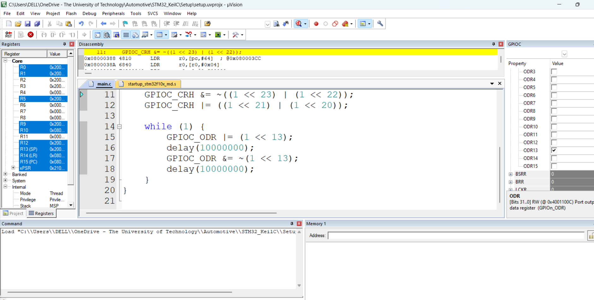

## 3. Dùng struct để định nghĩa các thanh ghi gọn hơn

- Các phần tử trong struct có địa chỉ liền kề nhau

```c
/*
 * Define Registers
#define RCC_APB2ENR  *((unsigned int *)0x40021018)
#define GPIOC_CRH    *((unsigned int *)0x40011004)
#define GPIOC_ODR    *((unsigned int *)0x4001100C)
*/
	
#define RCC ((RCC_TypeDef *)0x40021000)    // define first address of element in Typedef
#define GPIOC ((GPIO_TypeDef *)0x40011000)

/*
* Use struct to define shortly
*/
	
typedef struct
{
  unsigned int CRL;
  unsigned int CRH;
  unsigned int IDR;
  unsigned int ODR;
  unsigned int BSRR;
  unsigned int BRR;
  unsigned int LCKR;
} GPIO_TypeDef;


typedef struct
{
  unsigned int CR;
  unsigned int CFGR;
  unsigned int CIR;
  unsigned int APB2RSTR;
  unsigned int APB1RSTR;
  unsigned int AHBENR;
  unsigned int APB2ENR;
  unsigned int APB1ENR;
  unsigned int BDCR;
  unsigned int CSR;
} RCC_TypeDef;


void delay(unsigned int time) {
    for (unsigned int i = 0; i < time; i++);
}

int main() {
	
/*
    RCC_APB2ENR |= (1 << 4);  
    GPIOC_CRH &= ~((1 << 23) | (1 << 22));  
    GPIOC_CRH |= ((1 << 21) | (1 << 20));  

    while (1) {
        GPIOC_ODR |= (1 << 13);  
        delay(10000000);
        GPIOC_ODR &= ~(1 << 13);  
        delay(10000000);
    }
}
*/
	RCC->APB2ENR |= (1 << 4);  
    GPIOC->CRH &= ~((1 << 23) | (1 << 22));  
    GPIOC->CRH |= ((1 << 21) | (1 << 20));  

    while (1) {
        GPIOC->ODR |= (1 << 13);  
        delay(10000000);
        GPIOC->ODR &= ~(1 << 13);  
        delay(10000000);
    }
}
```

## 4. Đọc trạng thái nút nhấn PA0 -> nhấp nháy LED PC13

- Cấp clock cho 2 ngoại vi GPIOA & GPIOC

- `RCC->APB2ENR |= (1 << 2) | (1 << 4); //Kich hoat xung clock cap cho GPIOA và GPIOC`


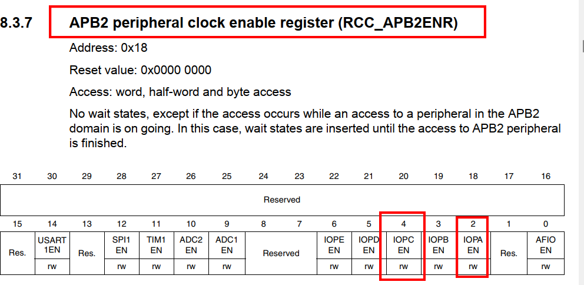

- Cấu hình các chế độ cho **GPIOA (PIN A0)**

- Chọn input pull - up resistor

- GPIO_ODR = 1 để chọn pull - up -> 1000 (CNF0 & MODE0 của thanh ghi CRL)

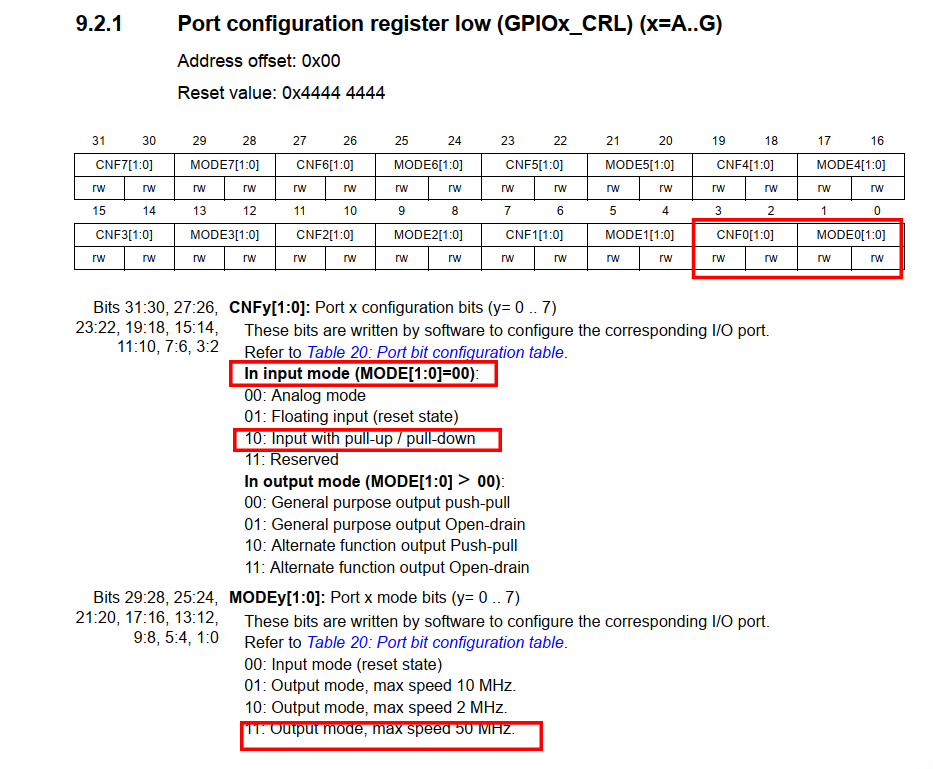

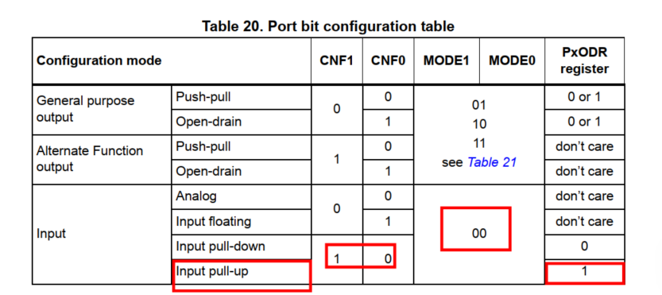

- Debug

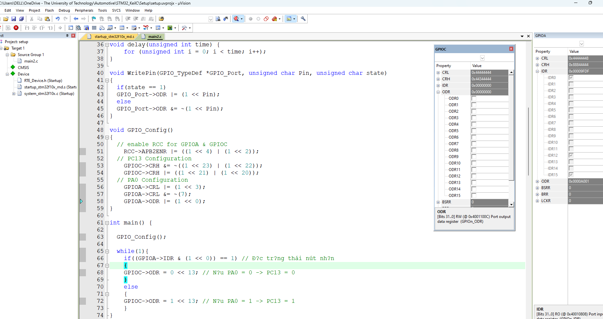

