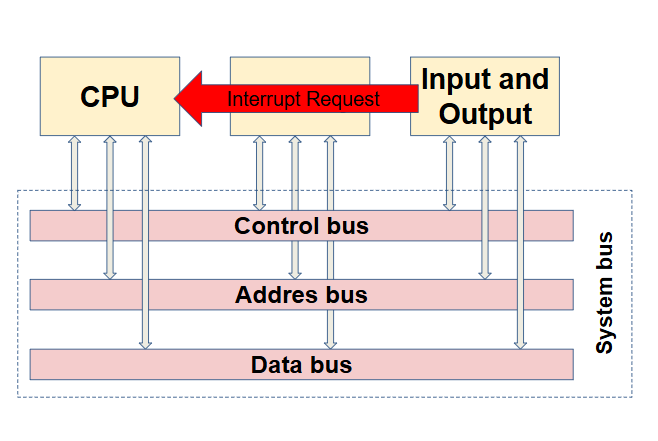
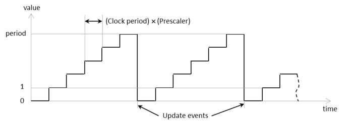
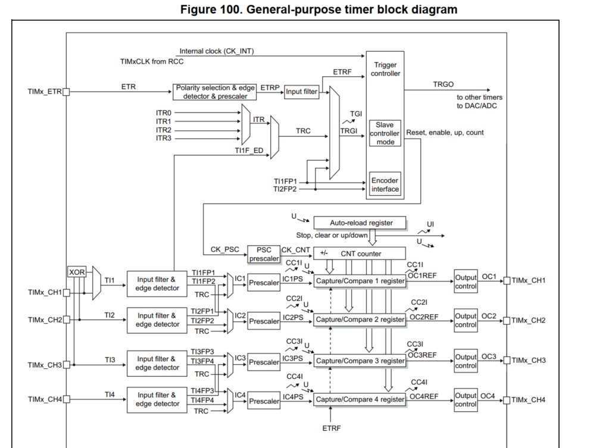
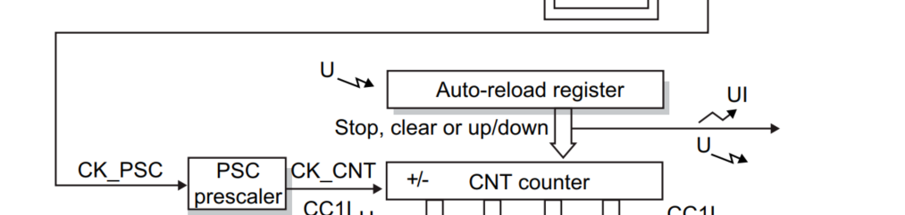
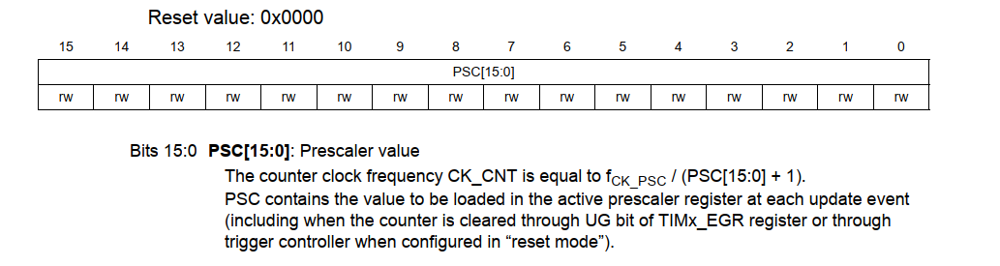
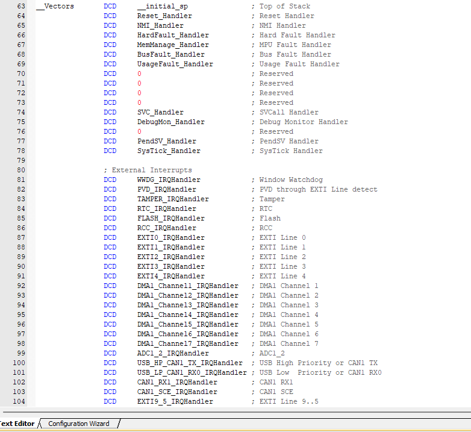

# Bài 3: Interrupt & TIMER

## 1. Interrupt

## 1.1. Định nghĩa ngắt

- Thông thường vi điều khiển hoạt động ở cơ chế polling (tuần tự, lệnh trên -> lệnh dưới)

- Ngắt: khi xảy ra sự kiện ngắt, yêu cầu MCU dừng chương trình chính đang thực thi để thực thi chương trình ngắt, sau khi thực hiện xong chương trình ngắt -> trở về lại chương trình chính (main)



**Khi có sự kiện ngắt xảy ra**

📌 **Tín hiệu yêu cầu ngắt** (IRQ - Interrupt Request Handler) gửi về MCU từ các ngoại vi (input, output, cảm biến, truyền nhận data,...) -> yêu cầu MCU thực hiện chương trình phục vụ ngắt ISR - Interrupt Service Rountine

📌 **NVIC (Bộ xử ngắt - Nested Vectored Interrupt Controller)**: Kiểm tra độ ưu tiên của ngắt vừa xảy ra, nếu có độ ưu tiên cao hơn thì thực thi ISR của IRQ 

***Độ ưu tiên ngắt***: 

- Các ngắt có độ ưu tiên khác nhau, quyết định thực thi ngắt nào khi nhiều ngắt xảy ra đồng thời (lập trình được)

- **Stack Pointer** chứa địa chỉ của đỉnh ngăn xếp (stack), dùng để quản lý dữ liệu tạm thời như biến cục bộ, địa chỉ trả về của hàm, và trạng thái thanh ghi 

📌 **Context Saving**: Lưu trạng thái hiện tại (địa chỉ) sử dụng **con trỏ PC** (con trỏ chỉ đến lệnh tiếp theo trong chương trình) -> khi thực thi xong ISR -> chương trình quay về lại chỗ cũ

📌 **Vector ngắt (địa chỉ trong bộ nhớ của ISR)**: Chương trình nhảy đến địa chỉ vector ngắt chứa ISR tương ứng để thực thi câu lệnh trong đó

📌 **Quay lại vị trí ban đầu**

ℹ️ PC & Stack Pointer trong Interrupt

**PC**

- Khi có một ngắt xảy ra, PC lưu địa chỉ của lệnh tiếp theo để có thể quay lại đúng vị trí sau khi xử lý ngắt.

- MCU sẽ đưa địa chỉ của PC vào stack trước khi nhảy đến Vector ngắt – nơi chứa địa chỉ của trình xử lý ngắt (ISR - Interrupt Service Routine).

- Sau khi xử lý ngắt, lệnh RETI (Return from Interrupt) sẽ lấy lại giá trị PC từ stack để tiếp tục thực thi chương trình chính từ nơi nó dừng lại.

**Stack Pointer**

*Trước khi vào ISR, MCU đẩy vào stack:*

- Giá trị của PC (địa chỉ của lệnh bị gián đoạn).

- Các thanh ghi quan trọng (tùy vào kiến trúc MCU).

- Cờ trạng thái (SREG trong AVR, CPSR trong ARM…).

- Trong ISR, CPU thực hiện các lệnh xử lý ngắt.

- Sau khi xử lý xong, các giá trị được khôi phục từ stack để tiếp tục chương trình chính.


## 1.2. Các ngắt thông dụng

### 1.2.1. Ngắt ngoài

- Tín hiệu ngắt đến từ các chân **GPIO**

**LOW**: kích hoạt ngắt liên tục khi chân ở mức 0.

**HIGH**: Kích hoạt liên tục khi chân ở mức 1.

**RISING**: Kích hoạt khi trạng thái trên chân chuyển từ thấp lên cao.

**FALLING**: Kích hoạt khi trạng thái trên chân chuyển từ cao xuống thấp.


### 1.2.2. Ngắt timer

- Ngắt xảy ra khi thanh ghi counter của timer bị tràn

- Sau khi tràn. counter register được reset



### 1.2.3. Ngắt truyền thông

- Xảy ra ở sự kiện truyền/ nhận dữ liệu (UART, SPI, I2C,...) -> đảm bảo việc truyền/ nhận dữ liệu chính xác

## 1.3. Độ ưu tiên ngắt

Trong thực tế, có những trường hợp sau: 
Chỉ 1 ngắt yêu cầu => chắc chắn đc phục vụ. 

**1 ngắt đang thực thi thì xuất hiện 1 yêu cầu ngắt khác.** 

(Ngắt EXTI đang được thực thi thì có yêu cầu ngắt từ System Timer) 

 📍 Yêu cầu ngắt mới có độ ưu tiên thấp hơn ngắt đang thực thi 

=> Phải chờ (ở trạng thái Pending) 

 📍 Yêu cầu ngắt mới có độ ưu tiên bằng ngắt đang thực thi

=> Phải chờ (ở trạng thái Pending)

 📍 Yêu cầu ngắt mới có độ ưu tiên cao hơn ngắt đang thực thi

=> Chiếm dụng ngắt (thực thi ngắt mới,trạng thái active, ngắt cũ sẽ ở trạng thái inactive )

## 2. Timer

- Bộ đếm thời gian của MCU bằng cách đếm các chu kì clock

- Block diagram của general purpose timer





- STM32F103 có 7 TIMER theo reference manual

| Timer  | Loại                 | Độ rộng | Tính năng chính                                      |
|--------|----------------------|---------|-----------------------------------------------------|
| **TIM1**  | Advanced-control    | 16-bit  | PWM nâng cao, Complementary output, Break input   |
| **TIM2**  | General-purpose     | 32-bit  | Timer/Capture/Compare/PWM                         |
| **TIM3**  | General-purpose     | 16-bit  | Timer/Capture/Compare/PWM                         |
| **TIM4**  | General-purpose     | 16-bit  | Timer/Capture/Compare/PWM                         |
| **TIM5**  | General-purpose     | 16-bit  | Timer/Capture/Compare/PWM                         |
| **TIM6**  | Basic               | 16-bit  | Timebase, DAC trigger, không có đầu ra PWM        |
| **TIM7**  | Basic               | 16-bit  | Timebase, DAC trigger, không có đầu ra PWM        |

## Cấu hình chế độ Ngắt Timer

### 2.1. Các thanh ghi cần thiết (cấu hình cho chân General - purpose Timer, TIM2)

```c
#define TIM2_BASE			0x40000000
#define TIM2_CR1			(*(volatile unsigned int*)(TIME_BASE + 0x00))
#define TIM2_DIER			(*(volatile unsigned int*)(TIME_BASE + 0x0C))
#define TIM2_SR			    (*(volatile unsigned int*)(TIME_BASE + 0x10))
#define TIM2_PSC			(*(volatile unsigned int*)(TIME_BASE + 0x28))
#define TIM2_ARR			(*(volatile unsigned int*)(TIME_BASE + 0x2C))
#define TIM2_CNT			(*(volatile unsigned int*)(TIME_BASE + 0x24))
```

- **CR1**: Điều khiển hoạt động của bộ counter, one-pulse mode, up/ down counter, enable/ disable bộ định thời

- **DIER**: bit 0 (UIE - update interrupt enable), cho phép ngắt hoạt động khi có sự kiện ngắt

- **SR**: Trạng thái của cờ ngắt **UIF (bit 0)**

- **PSC (Pre-scaler)**: thanh ghi chia trước, giá trị chia tần số cho bộ đếm



- **ARR**: Giá trị Auto-Reload của bộ đếm, khi tràn (CNT > ARR), ARR = 0 (nếu đếm lên) và gửi tín hiệu ngắt, update event

**CNT**: giá trị hiện tại của bộ đếm, sau 1 chu kì Timer thì đếm lên 1

**Bảng vector NVIC**



- Danh sách các địa chỉ hàm xử lý ngắt (**ISR**) được lưu trong bộ nhớ Flash tại địa chỉ **0x08000000** khi vi điều khiển STM32 khởi động. Khi một ngắt xảy ra, vi điều khiển sẽ tìm địa chỉ tương ứng của chương trình ngắt cần thực thi (**ISR**) trong bảng này -> chương trình nhảy đến hàm xử lý ISR (thanh ghi PC trỏ tới). Sau khi xử lý xong, quay lại chương trình chính

Gồm:

- Các vector xử lý lỗi hệ thống (**System Exception**)

- Vector ngắt ngoài (**External Interrupts**)

