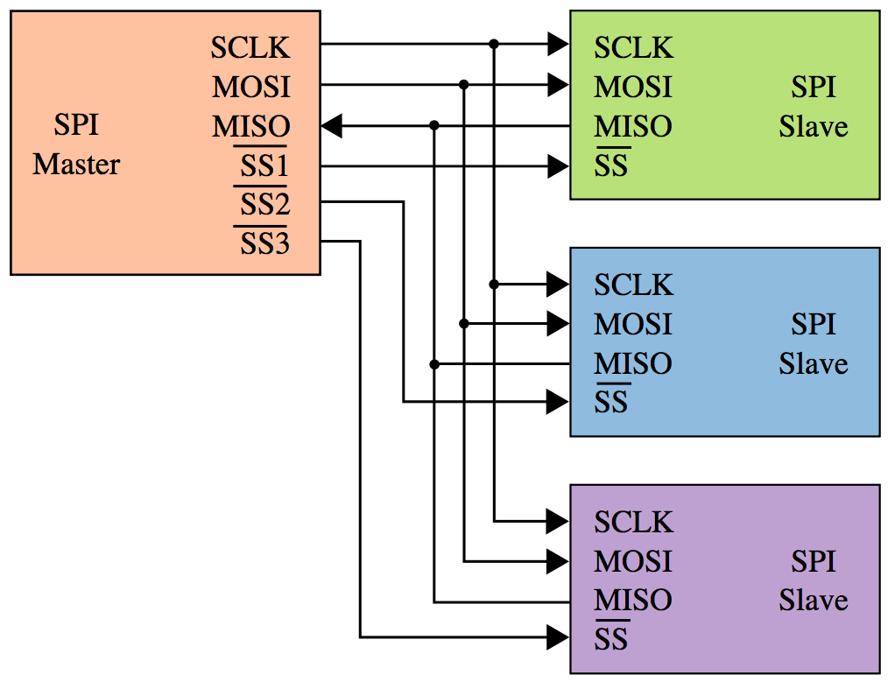
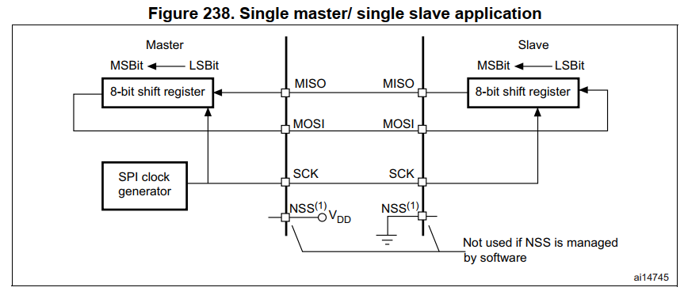
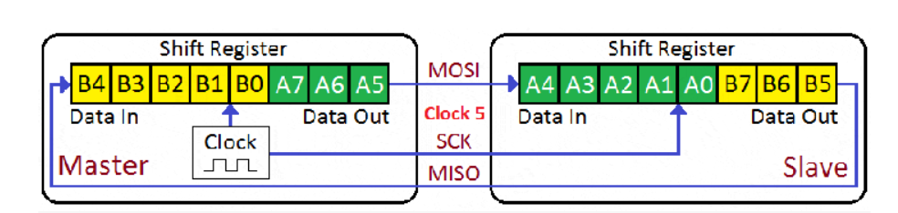
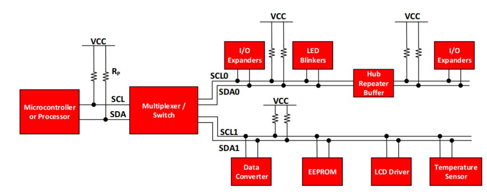
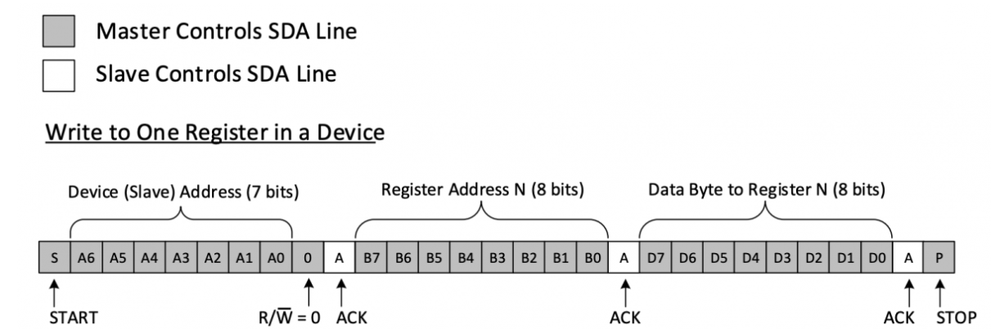
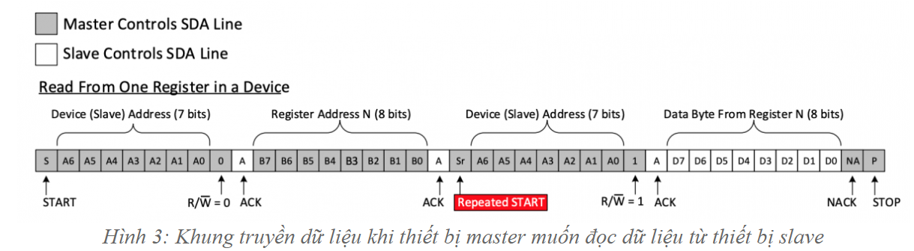
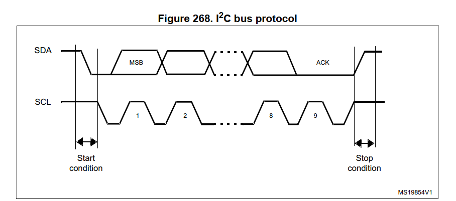
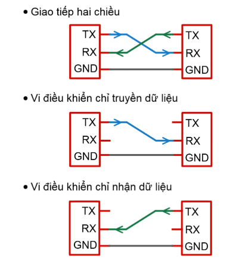
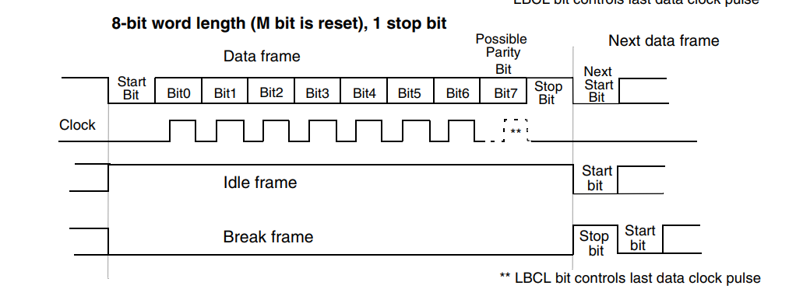
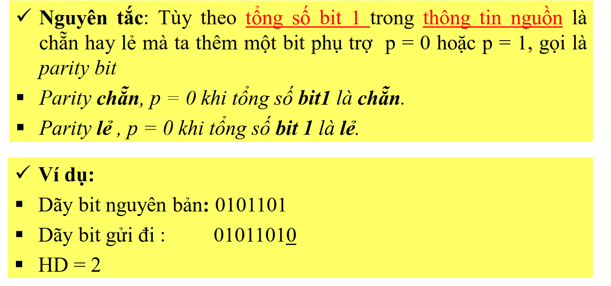

# Truyền nhận dữ liệu

- Là quá trình trao đổi điện áp giữa MCU A & MCU B

- Dữ liệu cần truyền được chuyển đổi thành các tín hiệu điện áp trên các chân tương ứng (0b 0011 0010)

- Cần truyền 2 bit 0 liên tiếp -> các chuẩn giao tiếp

# SPI (Serial Peripheral Interface/ Four wire)

## 1. Tổng quan

- Four wire - chuẩn giao tiếp 4 dây

- Kênh truyền nối tiếp song công (full duplex - có 2 đường truyền dữ liệu riêng biệt, một đường truyền và một đường nhận, cho phép dữ liệu truyền nhận theo 2 hướng cùng lúc)

- Đồng bộ (2 MCU giao tiếp với nhau, khi nào truyền, khi nào nhận)

- Là giao thức kiểu Master - Slave. Chỉ gồm 1 thiết bị Master, có thể có nhiều Slave

- Khối SPI của thiết bị Master sẽ kết nối với khối SPI của thiết bị Slave qua 4 chân tín hiệu

**SCK (Serial Clock)**: Xung giữ nhịp Clock - đồng bộ giữa Master & Slave

**MISO (Master Input Slave Output)**: Slave gửi dữ liệu cho Master

**MOSI (Master Output Slave Input)**: Master gửi dữ liệu đến Slave

**SS/ CS (Slave Select/ Chip Select)**: Master lựa chọn Slave để giao tiếp. Mức logic trên chân SS/CS của Slave nào xuống mức 0 -> Master đang giao tiếp với Slave đó

## **2. Cơ chế hoạt động**

- Mỗi thiết bị Master và Slave đều có một thanh ghi dịch 8 bits (Shift Register), một bộ tạo xung nhịp (Clock Generator).

- Khi Master truyền dữ liệu, Master truyền đi 8 bits dữ liệu vào thanh ghi dịch của nó, sau đó 8 bits dữ liệu được truyền theo đường tín hiệu MOSI sang thiết bị Slave. Tương tự khi Slave truyền dữ liệu, các bits trên thanh ghi dịch của Slave truyền đến Master thông qua đường tín hiệu MISO.

- Tùy mỗi mode hoạt động, Master & Slave quy định khi nào gửi khi nào nhận

### **4 chế độ SPI - CPOL & CPHA**

4 chế độ hoạt động được xác định bằng cách kết hợp cả hai bit **CPOL & CPHA** trong thanh ghi **SPI_CR1** 

**CPOL - Clock Polarity**: Xác định trạng thái **khi rảnh rỗi** của chân **SCK** khi không có dữ liệu được truyền

- **CPOL = 0** -> SCK ở mức thấp (**Low**) khi **idle**

- **CPOL = 1** -> SCK ở mức cao (**High**) khi **idle**

**CPHA - Clock Phase**: Xác định cạnh xung của SCK sẽ được sử dụng để **lấy mẫu dữ liệu**:

- **CPHA = 0** -> lấy dữ liệu tại **cạnh đầu tiên** (**rising** nếu **CPOL = 0**, **falling** nếu **CPOL = 1**)

| CPOL | CPHA | Thời điểm đọc dữ liệu (Read on) | Thời điểm cập nhật dữ liệu/ truyền dữ liệu (Changed on) | Chế độ SPI |
|------|------|-------------------------------|-----------------------------------------|------------|
| 0    | 0    | Cạnh lên (rising edge)        | Cạnh xuống (falling edge)              | 0          |
| 0    | 1    | Cạnh xuống (falling edge)     | Cạnh lên (rising edge)                 | 1          |
| 1    | 0    | Cạnh xuống (falling edge)     | Cạnh lên (rising edge)                 | 2          |
| 1    | 1    | Cạnh lên (rising edge)        | Cạnh xuống (falling edge)              | 3          |

# I2C (Inter-intergrated circuit)

## **1. Tổng quan**

- Tại một thời điểm chỉ có **duy nhất một thiết bị master** ở trạng thái hoạt động trên bus I2C. 

- **Master** điều khiển bus clock SCL và quyết định hoạt động nào sẽ được thực hiện trên bus dữ liệu SDA. Tất cả các thiết bị đáp ứng các yêu cầu từ thiết bị master này đều là slave. 

- Để **phân biệt giữa nhiều thiết bị slave** khi được kết nối với cùng một hệ thống bus I2C thì **mỗi thiết bị slave sẽ có một địa chỉ vật lý 7-bit cố định**.

- Khi một thiết bị master muốn truyền hoặc nhận dữ liệu từ một thiết bị slave, master sẽ xác định địa chỉ thiết bị slave cụ thể trên đường SDA và sau đó tiến hành truyền dữ liệu. Tất cả các thiết bị slave khác không gửi tín hiệu phản hồi về, trừ khi địa chỉ của chúng được chỉ định bởi thiết bị master trên đường SDA.

## **2. Cơ chế hoạt động**

***Trường hợp 1: Master gửi dữ liệu cho Slave***

- Master thực hiện một điều kiện bắt đầu (START)

- Master gửi địa chỉ của slave (Device Address) cần nhận dữ liệu và Bit cấu hình đọc ghi dữ liệu (R/W) được gửi kèm có giá trị bằng 0 thể hiện hoạt động gửi dữ liệu. 

- Slave phản hồi bằng bit xác nhận (ACK), xác nhận có slave hoạt động trên hệ thống bus

- Master gửi địa chỉ thanh ghi của slave – địa chỉ mà master muốn ghi/bắt đầu ghi dữ liệu.

- Slave phản hồi bằng bit xác nhận (ACK), xác nhận có địa chỉ thanh thi, sẵn sàng nhận dữ liệu
Master gửi các dữ liệu (Data) cần ghi vào thanh ghi cho slave, có thể một hoặc nhiều byte.

- Master thực hiện kết thúc việc truyền dữ liệu bằng một điều kiện kết thúc (STOP).

***Trường hợp 1: Master đọc dữ liệu từ Slave***

- Master thực hiện một điều kiện bắt đầu (START)

- Master gửi địa chỉ của slave (Device Address) cần nhận dữ liệu, theo kèm là bit cấu hình đọc ghi dữ liệu (R/W) có giá trị bằng 0 thể hiện hoạt động gửi dữ liệu (bằng 0 để gửi tiếp địa chỉ thanh ghi)

- Slave phản hồi bằng bit xác nhận (ACK), xác nhận có slave hoạt động trên hệ thống bus

- Master gửi địa chỉ thanh ghi của Slave – địa chỉ mà master muốn ghi /bắt đầu ghi dữ liệu.

- Slave phản hồi bằng bit xác nhận (ACK), xác nhận có địa chỉ thanh ghi trên thiết bị slave. 

- Master gửi lại điều kiện bắt đầu cùng với địa chỉ của thiết bị slave, theo sau đó là giá trị 1 của bit R/W thể hiện hoạt động đọc dữ liệu.

- Slave phản hồi bằng bit xác nhận (ACK) 
Master nhận dữ liệu từ slave, có thể một hoặc nhiều byte.

- Master kết thúc việc nhận dữ liệu bằng cách thực hiện bit xác nhận (NACK) và theo sau đó là một điều kiện kết thúc (STOP).

### Phân tích thành phần trong khung truyền

*Điều kiện bắt đầu và điều kiện kết thúc (START, STOP)*

- Giao tiếp I2C được khởi tạo bằng cách master thực hiện điều kiện bắt đầu và kết thúc bằng cách master thực hiện điều kiện kết thúc. Một sự chuyển đổi logic từ mức HIGH sang mức LOW trên đường truyền SDA trong khi đường truyền SCL ở mức HIGH được định nghĩa là một điều kiện bắt đầu. Một sự chuyển đổi mức logic từ mức LOW sang mức HIGH trên đường truyền SDA trong khi đường SCL ở mức HIGH được định nghĩa là điều kiện kết thúc. 

*Các bit địa chỉ*

- Các bit địa chỉ giúp xác định, phân biệt các slave khác nhau trên hệ thống bus I2C, các master phải có/ được cài đặt các địa chỉ khác nhau. 

- Thông thường có 7 bit địa chỉ.

- Bit địa chỉ được gửi kèm với bit cầu hình đọc/ghi dữ liệu.

*Bit cấu hình đọc/ ghi dữ liệu (R/ W)*

- Bit này xác định hướng truyền dữ liệu hay có thể hiểu là thiết bị nào sẽ điều khiển đường SDA: Nếu Master cần truyền dữ liệu đến Slave, bit Read / Write được thiết lập mức logic LOW. Ngược lại, nếu Master cần nhận dữ liệu từ Slave, bit này được thiết lập mức logic HIGH.

*Bit xác nhận (ACK/NACK)*

- Mỗi byte dữ liệu đều được xác nhận bởi một bit ACK từ phía nhận dữ liệu gửi cho phía gửi dữ liệu để báo rằng byte đã được nhận thành công và có thể tiếp tục gửi byte dữ liệu tiếp theo. Bit ACK có giá trị LOW. Khi nó có giá trị HIGH thì được gọi là bit NACK, bit NACK được gửi đi trong một số trường hợp như: 

- Phía nhận đang bận và không thể nhận hay truyền dữ liệu vì đang thực hiện một tính năng khác. 

- Trong quá trình truyền nhận, dữ liệu/địa chỉ không hợp lệ, không tồn tại. 

- Trong quá trình truyền, phía nhận không thể nhận thêm các byte dữ liệu nữa.
 
- Trong trường hợp master yêu cầu dữ liệu từ slave, master đã nhận đủ và không nhận thêm dữ liệu. 

*Các bit dữ liệu (Data)*

Dữ liệu được truyền tới các thiết bị slave hoặc được đọc từ các thiết bị slave, bản chất của việc này chính là thực hiện đọc/ghi các thanh ghi trong thiết bị slave. Các thanh ghi này nằm trong bộ nhớ của slave và được xác định, phân biệt bởi các địa chỉ, các thanh ghi sẽ chứa thông tin, có thể là thông tin cấu hình hoạt động của thiết bị slave, có thể thông tin dữ liệu mà slave có được trong quá trình hoạt động như dữ liệu lấy mẫu từ cảm biến. Để điều khiển thiết bị slave thực hiện một nhiệm vụ chức nào đó, master cũng sẽ thực hiện việc ghi vào thanh ghi của thiết bị slave. 

*Lặp lại điều kiện bắt đầu (Repeated Start)*

- Việc thiết bị master thực hiện lặp lại điều kiện bắt đầu cũng tương tự như việc master thực hiện điều kiện bắt đầu (START), lặp lại điều kiện bắt đầu được sử dụng để thay thế cho việc thực hiện điều kiện STOP rồi thực hiện điều kiện START. 

- Lặp lại điều kiện bắt đầu được sử dụng trong trường hợp thiết bị master muốn đọc dữ liệu từ thiết bị slave sau khi đã nhận các phản hồi về địa chỉ thiết bị slave và địa chỉ thanh ghi muốn đọc dữ liệu. 

# UART (Universal synchronous asynchronous receiver transmitter)

- Bộ truyền nhận **nối tiếp, không đồng bộ** (không có đường dây xung nhịp SCK nối giữa 2 thiết bị)

- Chỉ có 2 thiết bị giao tiếp với nhau, 2 dây để giao tiếp

## **1. Baudrate**: 

- Số bit truyền được trong 1 giây. Đơn vị: bps (bits per second)

- Cần thống nhất tốc độ baud giữa hai thiết bị với nhau để thời gian truyền 1 bit và nhận 1 là giống nhau

- Một số giá trị Baudrate thường gặp: 1200, 2400, 4800, 9600, 19200, 38400, 57600, 115200…

- Tốc độ baud càng cao thì tốc độ truyền/nhận dữ liệu càng nhanh

| Tiêu chí             | Tốc độ Bit (Bit Rate)                             | Tốc độ Baud (Baud Rate)                        |
|----------------------|--------------------------------------------------|-----------------------------------------------|
| **Định nghĩa**       | Số bit được truyền trong mỗi giây (**bps - bits per second**). | Số đơn vị tín hiệu được truyền trong mỗi giây (**baud**). |
| **Đơn vị đo**        | **bps (bits per second)** | **Bd (baud)** |
| **Ý nghĩa**         | Đánh giá lượng dữ liệu thực tế được truyền đi. | Đánh giá số lần tín hiệu thay đổi trên đường truyền. |
| **Công thức liên hệ** | `Bit Rate = Baud Rate × Số bit trên mỗi đơn vị tín hiệu` | `Baud Rate = Bit Rate / Số bit trên mỗi đơn vị tín hiệu` |
| **Khi nào bằng nhau?** | Khi mỗi đơn vị tín hiệu chỉ chứa **1 bit** (VD: NRZ - Non-Return to Zero). | Khi mỗi đơn vị tín hiệu chỉ chứa **1 bit**, tốc độ baud và tốc độ bit sẽ bằng nhau. |
| **Khi nào khác nhau?** | Khi mỗi đơn vị tín hiệu chứa nhiều hơn **1 bit** (VD: QAM, PSK, FSK). | Khi sử dụng các phương pháp điều chế cho phép một symbol mang nhiều bit dữ liệu. |
| **Ví dụ** | Một hệ thống truyền dữ liệu có tốc độ **1000 bps**, mỗi symbol mang **2 bit**, vậy tốc độ baud là: `1000 bps / 2 = 500 baud`. | Một hệ thống truyền dữ liệu có tốc độ baud là **500 baud**, mỗi symbol mang **2 bit**, vậy tốc độ bit là: `500 baud × 2 = 1000 bps`. |

## **2. Frame:** 

- Ngoài việc giống nhau của tốc độ baud 2 thiết bị truyền nhận thì khung truyền của bên cũng được cấu hình giống nhau. 

- Khung truyền quy định số bit trong mỗi lần truyền, bit bắt đầu “Start bit”, các bit kết thúc (Stop bit), bit kiểm tra tính chẵn lẻ (Parity), ngoài ra số bit quy định trong một gói dữ liệu cũng được quy định bởi khung truyền.

- **Idle frame:** Đường truyền UART ở mức “1”, để xác nhận hiện tại đường truyền dữ liệu trống, không có frame nào đang được truyền đi.

- **Break frame:** Đường truyền UART ở mức “0”, để xác nhận hiện tại trên đường truyền đang truyền dữ liệu, có frame đang được truyền đi.

## 3. Start bit

- Start bit: Bit đầu tiên được truyền trong một frame, bit này có chức năng báo cho bên nhận rằng sắp có một gói dữ liệu truyền đến. 

- Đường truyền UART luôn ở trạng thái cao mức “1” cho đến khi chip muốn truyền dữ liệu đi thì nó gởi bit start bằng cách kéo xuống mức “0”. Như vậy start bit giá trị điện áp 0V và phải bắt buộc có bit start trong khung truyền

## 4. Data

- Data hay dữ liệu là thông tin mà chúng ta nhận được trong quá trình truyền và nhận. Data trong STM32 có quy định khung truyền là 8bit hoặc 9bit. 

- Trong quá trình truyền UART, bit có trọng số thấp nhất (LSB – least significant bit – bên phải) sẽ được truyền trước và cuối cùng là bit có ảnh hưởng cao nhất (MSB – most significant bit – bên trái)

## 5. Parity bit

- Parity dùng để kiểm tra dữ liệu truyền có đúng hay không

## 6. Stop bit

-  Stop bits là một bit báo cáo để cho bộ truyền/nhận biết được gói dữ liệu đã được gởi xong. Stop bits là bit bắt buộc phải có trong khung truyền. 

-  Stop bits có thể là 1bit, 1.5bit, 2bit, 0.5bit tùy thuộc vào ứng dụng UART của người sử dụng.

