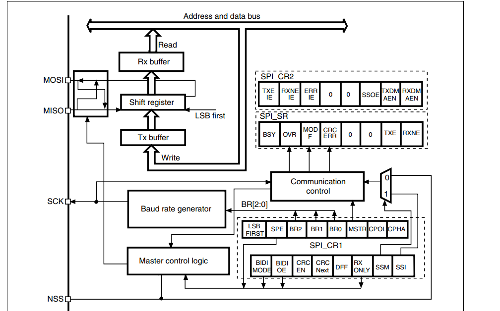

# Project SPI

- Vi điều khiển có tích hợp module SPI, điều khiển bởi các thanh ghi, phần cứng, IO khác nhau -> **Hardware SPI** -> bản chất SPI giống nhau trên mỗi chip lại được **cài đặt và sử dụng không giống nhau** ->  Khó khăn cho người sử dụng khi bắt đầu tìm hiểu vi điều khiển mới vì các chân MISO, MOSI, SS, SCK đặt khác nhau.

- Để khắc phục, **lập trình giả lập** hardware SPI (**Software SPI**), tạo ra một giao thức truyền thông giống SPI nhưng chỉ sử dụng các cổng GPIO của vi điều khiển -> có thể sử dụng trên bất kì vi điều khiển nào

## SPI software full duplex

### 1. Define Pins

### 2. Cấp xung clock cho đường bus cần thiết

### 3. Tạo xung clock SCK

```c
// tao xung clock SCK
void Clock_H(){
	GPIO_WriteBit(SPI_GPIO, SPI_SCK, Bit_SET);
	delay_ms(4);
}

void Clock_L(){
	GPIO_WriteBit(SPI_GPIO, SPI_SCK, Bit_RESET);
	delay_ms(4);
}

```
### 4. GPIO_Config()

- Cấu hình GPIO ở 2 Master và Slave

### 5. Khởi tạo SPI

```c
void SPI_Init(){
	GPIO_WriteBit(SPI_GPIO, SPI_SCK, Bit_RESET);  // Mode CPOL = CPHA = 0
	GPIO_WriteBit(SPI_GPIO, SPI_CS, Bit_SET);
	GPIO_WriteBit(SPI_GPIO, SPI_MISO, Bit_RESET);
	GPIO_WriteBit(SPI_GPIO, SPI_MOSI, Bit_RESET);
}
```

### 6. Viết hàm truyền nhận

Hàm truyền sẽ truyền lần lượt 8 bit trong byte dữ liệu. 

Kéo CS xuống 0.

Truyền 1 bit.

Dịch 1 bit.

Gửi clock();

Trong lúc gửi clock, nhận dữ liệu Slave gửi về thông qua MOSI

Kéo CS lên 1;

```c
uint8_t SPI_Master_TransmitReceive(uint8_t u8Data){	//0b10010000
	uint8_t u8Mask = 0x80;	// 0b10000000 mask bit
	uint8_t DataMasterReceive = 0x00;
	uint8_t tempData;
	GPIO_WriteBit(SPI_GPIO, SPI_CS, Bit_RESET);
	delay_ms(1);
	for(int i = 0; i < 8; i++){
		tempData = u8Data & u8Mask;
		if(tempData){
			GPIO_WriteBit(SPI_GPIO, SPI_MOSI, Bit_SET);
			delay_ms(1);
		} else{
			GPIO_WriteBit(SPI_GPIO, SPI_MOSI, Bit_RESET);
			delay_ms(1);
		}
		u8Data = u8Data << 1; // dịch 1 bit đã truyền
		GPIO_SetBits(GPIOA, SPI_SCK);
		DataMasterReceive = (DataMasterReceive << 1) | GPIO_ReadInputDataBit(SPI_GPIO, SPI_MISO); // nhận dữ liệu từ chân MISO
		delay_ms(4);
		GPIO_ResetBits(GPIOA, SPI_SCK);
		delay_ms(4);
	}
	GPIO_WriteBit(SPI_GPIO, SPI_CS, Bit_SET);
	delay_ms(1);
	
	return DataMasterReceive;
}
```

## SPI hardware full duplex

Tương tự

### 1. Cấu hình các chân SPI

- Define các chân SPI dựa trên bảng chức năng của GPIO trong datasheet

- Mode của GPIO là **AF_PP**, chức năng thay thế cho chức năng bình thường của GPIO, kết nối đến SPI block

```c
void GPIO_config()
{
	GPIO_InitTypeDef GPIO_InitStructure;
	
	GPIO_InitStructure.GPIO_Pin = SPI1_NSS | SPI1_SCK | SPI1_MISO | SPI1_MOSI;
	GPIO_InitStructure.GPIO_Speed = GPIO_Speed_50MHz;
	GPIO_InitStructure.GPIO_Mode = GPIO_Mode_AF_PP; // afternation push-pull, connect to SPI block
	
	GPIO_Init(SPI1_GPIO, &GPIO_InitStructure);
}
```

### 2. SPI config()

```c
// SPI configuration
void SPI_Config()
{
	SPI_InitTypeDef SPI_InitStructure;
	
	SPI_InitStructure.SPI_Mode = SPI_Mode_Master;
	SPI_InitStructure.SPI_Direction = SPI_Direction_2Lines_FullDuplex;
	SPI_InitStructure.SPI_BaudRatePrescaler = SPI_BaudRatePrescaler_16;
	SPI_InitStructure.SPI_CPHA = SPI_CPHA_1Edge;
	SPI_InitStructure.SPI_CPOL = SPI_CPOL_Low;
	SPI_InitStructure.SPI_DataSize = SPI_DataSize_8b;
	SPI_InitStructure.SPI_FirstBit = SPI_FirstBit_MSB;
	SPI_InitStructure.SPI_CRCPolynomial = 7; // check sum CRC bac 7
	SPI_InitStructure.SPI_NSS = SPI_NSS_Soft;// kiem soat chan NSS/CS bang software
	
	SPI_Init(SPI1, &SPI_InitStructure); // save to register
	SPI_Cmd(SPI1, ENABLE);	
}
```

- SPI_Mode: chế độ Master/ Slave

- SPI_Direction: half duplex/ full duplex

- SPI_BaudRatePrescaler: tốc độ truyền của SPI

- SPI_InitStructure.SPI_CPHA = SPI_CPHA_1Edge;

- SPI_InitStructure.SPI_CPOL = SPI_CPOL_Low;

SPI_CPOL: Cấu hình cực tính của SCK . Có 2 chế độ:

SPI_CPOL_Low: Cực tính mức 0 khi SCK không truyền xung.

SPI_CPOL_High: Cực tính mức 1 khi SCK không truyền xung.

SPI_CPHA: Cấu hình chế độ hoạt động của SCK. Có 2 chế độ:

SPI_CPHA_1Edge: Tín hiệu truyền đi ở cạnh xung đầu tiên.

SPI_CPHA_2Edge: Tín hiệu truyền đi ở cạnh xung thứ hai.

### 3. Sử dụng các cờ trong SPI để truyền tín hiệu




- SPI hoạt động kiểu full-duplex nghĩa là: trong mỗi chu kỳ clock, vừa truyền (MOSI), vừa nhận (MISO) một bit dữ liệu.

- Tx buffer: chứa dữ liệu để gửi đi (ra MOSI).

- Shift register: hoạt động như cầu nối truyền nhận đồng thời.

- Rx buffer: chứa dữ liệu nhận được (từ MISO).

##  1. TXE - Cờ Tx buffer trống (Transmit buffer empty flag)

- Khi TXE được set (`TXE = 1`): → **Tx buffer đang trống**, có thể nạp byte dữ liệu tiếp theo để truyền.

- Cờ TXE sẽ bị xóa (`TXE = 0`) khi **ghi dữ liệu vào thanh ghi `SPI_DR`**.

---

##  2. RXNE - Cờ Rx buffer chứa dữ liệu (Receive buffer not empty flag)

- Khi RXNE được set (`RXNE = 1`): → **Có dữ liệu hợp lệ trong Rx buffer**, có thể đọc từ `SPI_DR`.

- Cờ RXNE sẽ bị xóa khi **đọc thanh ghi `SPI_DR`**.

---

##  3. BSY - Cờ SPI đang bận (BUSY flag)

- Cờ BSY được phần cứng set và clear tự động – **không thể thay đổi bằng phần mềm**.

- Khi `BSY = 1`: **SPI đang bận giao tiếp** (truyền hoặc nhận).

- Khi `BSY = 0`: **SPI đã rảnh**, có thể vô hiệu hóa SPI hoặc tắt xung clock ngoại vi.

⚠️ **Ngoại lệ**:
- Trong **chế độ master + nhận 1 chiều** (`MSTR = 1`, `BDM = 1`, `BDOE = 0`)  
  → **BSY sẽ giữ ở mức thấp (0)** ngay cả khi đang nhận.

---

### Khi nào **BSY được set**:

- Khi một phiên truyền bắt đầu (trừ trường hợp ngoại lệ bên trên).

### Khi nào **BSY được clear**:

- Khi truyền xong  

- Khi SPI bị tắt  

- Khi có lỗi chế độ master (`MODF = 1`)


```c
uint8_t SPI_Master_Transmit_Send1Byte(uint8_t data)
{
	  uint8_t temp;
	
		GPIO_ResetBits(GPIOA, SPI1_NSS); // chờ chân CS = 0 để bắt đầu giao tiếp
	  // transmit
		while(SPI_I2S_GetFlagStatus(SPI1, SPI_I2S_FLAG_TXE) == RESET){} // chờ đến khi TX_buffer rỗng
    SPI_I2S_SendData(SPI1, (uint16_t)data);
    
		// recieve
		while(SPI_I2S_GetFlagStatus(SPI1, SPI_I2S_FLAG_RXNE)==0){}   // dữ liệu đã có trong RX_buffer
		temp = (uint8_t)SPI_I2S_ReceiveData(SPI1);
			
    while(SPI_I2S_GetFlagStatus(SPI1, SPI_I2S_FLAG_BSY)==1){}
			
		GPIO_SetBits(GPIOA, SPI1_NSS);
			
		return temp;
}
```