- Cấu hình GPIO của I2C ở chế độ open drain

**open drain**

Là chế độ chân output chỉ có thể kéo xuống mức thấp (0).

Khi muốn "thả" mức cao (1), nó không tự kéo lên mà sẽ để chân ở trạng thái "hở" (không tác động gì).

Mức cao (1) được duy trì nhờ điện trở kéo lên (pull-up resistor) gắn bên ngoài.

**Tại sao?**

- Để nhiều thiết bị chia sẻ bus mà không bị xung đột

- **R pull - up** .Giá trị thường dùng: 4.7kΩ đến 10kΩ, tùy thuộc vào tốc độ I2C và số lượng thiết bị.

**Đường bus SDA được Master và Slave chia sẻ/ dùng chung với nhau** theo cơ chế AND dữ liệu, Master kiểm soát đường dây. Khi đưa đường SDA lên 1 -> Slave truyền dữ liệu

# Software

## 1. Cấu hình GPIO, define macro

```c
#define I2C_SCL		GPIO_Pin_6
#define I2C_SDA		GPIO_Pin_7

#define I2C_GPIO  GPIOB

#define WRITE_SDA_0 GPIO_ResetBits(I2C_GPIO, I2C_SDA)
#define WRITE_SDA_1 GPIO_SetBits(I2C_GPIO, I2C_SDA)
#define WRITE_SCL_0 GPIO_ResetBits(I2C_GPIO, I2C_SCL)
#define WRITE_SCL_1 GPIO_SetBits(I2C_GPIO, I2C_SCL)
#define READ_SDA_VAL 	GPIO_ReadInputDataBit(I2C_GPIO, I2C_SDA)

typedef enum {
	NOT_OK, OK
} status;

typedef enum{
	NACK, ACK
} ACK_Bit;
```

## 2. Truyền nhận dữ liệu

Master Phát Địa Chỉ Slave: Sau khi Start Condition, Master gửi địa chỉ 7 bit của Slave lên bus kèm theo một bit đọc/ghi (R/W).

- Nếu bit R/W là 0, Master yêu cầu ghi (truyền dữ liệu tới Slave).

- Nếu bit R/W là 1, Master yêu cầu đọc (đọc dữ liệu từ 1 thanh ghi tron Slave).

Acknowledge (ACK): Mỗi khi một byte (8 bit) được truyền đi, thiết bị Slave sẽ phản hồi bằng cách kéo đường SDA xuống thấp trong 1 bit thời gian để cho biết nó đã nhận được byte. Đây được gọi là bit ACK.

- Giao tiếp

**Write data**: Master gửi từng byte đến Slave, và Slave sẽ phản hồi lại bằng một bit ACK sau mỗi byte.

**Read data**: Master đọc từng byte từ Slave, và sau mỗi byte, Master phát lại bit ACK để báo rằng dữ liệu đã được nhận. (có hoặc ko).

Kết thúc Giao tiếp: Khi quá trình truyền dữ liệu hoàn tất, Master phát Stop Condition để ngắt kết nối với Slave.

- **Start & Stop condition**
```c
void I2C_Start()
{
	WRITE_SDA_0; // SDA reset 0 before SCL
	delay_us(3);
	WRITE_SCL_0;
	delay_us(3);
}

void I2C_Stop()
{
	WRITE_SCL_1; // SCL set 1 before SDA
	delay_us(3);
	WRITE_SDA_1;
	delay_us(3);
}
```

- **Write data & Read data**

```c
status I2C_Master_Write(uint8_t u8Data) // Send Address/ Data to Slave, Slave receive -> send ACK
{
	status stRet;
	for(int i = 0; i < 8; i++)
	{
		if(u8Data & 0x80)
		{
			WRITE_SDA_1;
		}
		else
		{
			WRITE_SDA_0;
		}
		delay_us(3);
		
		// Clock
		WRITE_SCL_1;
		delay_us(5);
		WRITE_SCL_0;
		delay_us(5);
		
		// Shift 1 bit to the left
		u8Data <<= 1;
	}
	
	WRITE_SDA_1;        // Set SDA = 1 to read ACK from Slave (if Slave send ACK, SDA = 0)
	delay_us(3);
	WRITE_SCL_1;
	delay_us(3);
	
	if(READ_SDA_VAL)    // SDA = 0 -> ACK, SDA = 1 -> NACK
	{ 
		stRet = NOT_OK;
	}
	else
	{
		stRet = OK;
	}
	
	delay_us(2);        // Clock SCK = 5uS -> Read at the middle to avoid bouncing
	WRITE_SCL_0;
	delay_us(5);
	
	return stRet;
}
	
uint8_t I2C_Master_Read	(ACK_Bit _ACK)
{
	uint8_t i;
	uint8_t u8Ret = 0x00;
	WRITE_SDA_1;
	delay_us(3);
	for(i = 0; i < 8; ++i)
	{
		u8Ret <<= 1;
		delay_us(3);
		if(READ_SDA_VAL)  // read register of Slave on SDA bus
		{
			u8Ret |= 0x01;
		}
		delay_us(2);
		WRITE_SCL_0;
		delay_us(5);
	}
	if(_ACK)
	{
		WRITE_SDA_0;
	}
	else
	{
		WRITE_SDA_1;
	}
	delay_us(3);
	
	WRITE_SCL_1;
	delay_us(5);
	WRITE_SCL_0;
	delay_us(5);

	return u8Ret;
}

```

# Hardware

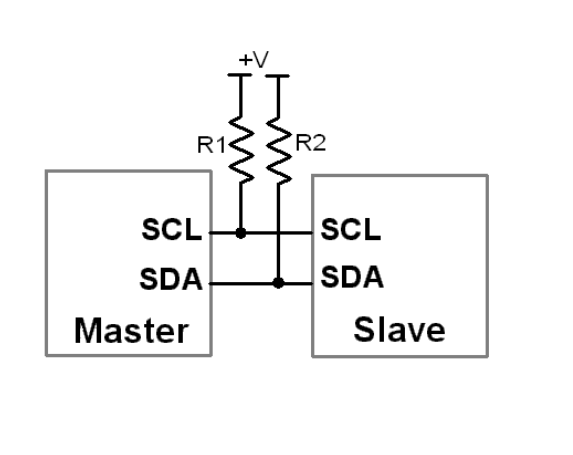

## 1. Xác định các chân GPIO của bộ I2C

- Dùng bộ I2C1 của STM32, chân SCL là PB6 còn SDA là PB7

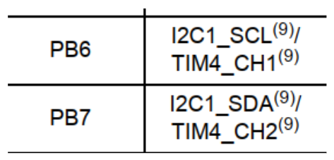

```c

#define I2C_SCL 	GPIO_Pin_6
#define I2C_SDA		GPIO_Pin_7

#define I2C1_GPIO 	GPIOB

```
## 2. Cấu hình GPIO - tương tự như đã làm ở software

```c

void GPIO_Config(void) {
    GPIO_InitTypeDef GPIO_InitStructure;

    RCC_APB2PeriphClockCmd(RCC_APB2Periph_GPIOB, ENABLE);

    GPIO_InitStructure.GPIO_Pin = GPIO_Pin_6 | GPIO_Pin_7; 
    GPIO_InitStructure.GPIO_Mode = GPIO_Mode_AF_OD;
    GPIO_InitStructure.GPIO_Speed = GPIO_Speed_50MHz;
    GPIO_Init(GPIOB, &GPIO_InitStructure);
}

```

## 3. Cấu hình I2C

- Được cấu hình trong Struct I2C_InitTypeDef


# Giao tiếp I2C với MPU6050
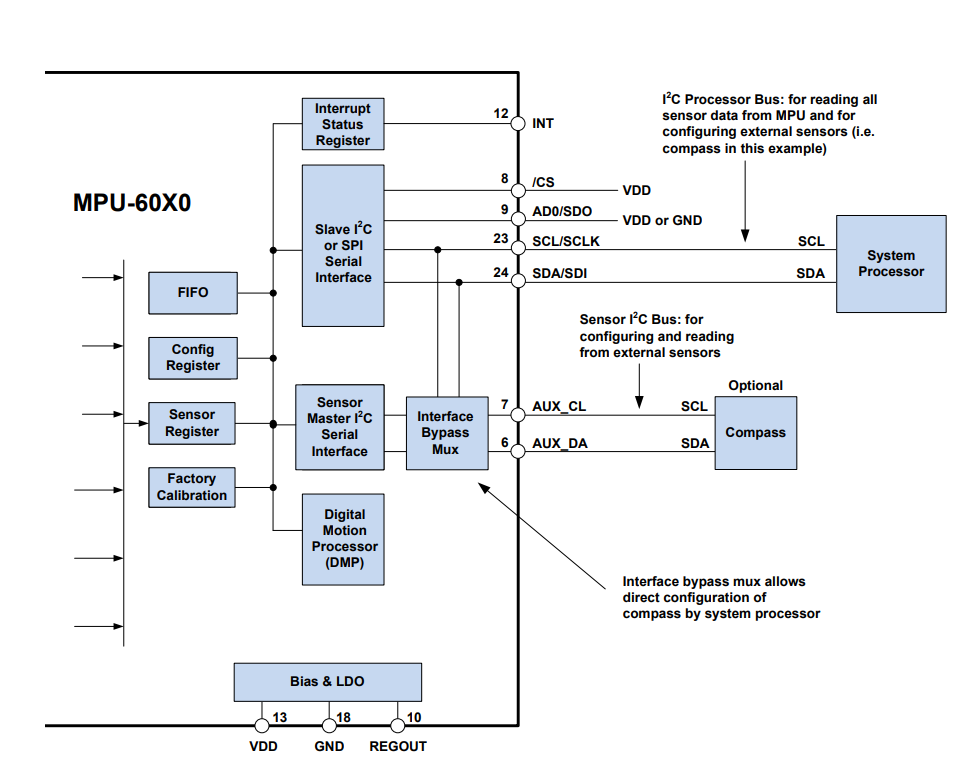

## 1. Địa chỉ của SLave

- **Địa chỉ 7 bit** của MPU6050 là b110100X, X phụ thuộc vào chân C0, bình thường không cắm để đơn giản -> logic chân C0 là **LOW**. Địa chỉ Slave MPU6050 là **0x68**
- Master cần gửi dữ liệu cho Slave, **bit R/W = 0, Master gửi dữ liệu đến Slave** -> gửi **0XD0**

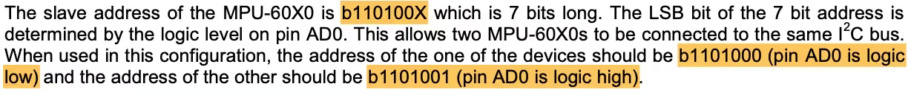

## 2. Thanh ghi WHO_AM_I

- Kiểm tra xem MPU không bằng cách đọc giá trị phản hồi từ thanh ghi **0x75**. Nếu đọc được **0x68** -> đã hoạt động

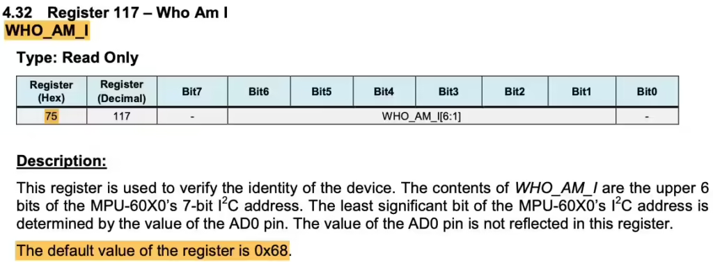

## 3. Thanh ghi PWR_MGMT_1 - Power Management

- Đặt thanh ghi này = 0

	- Chọn nguồn xung nhịp bên trong là 8MHz

	- Cảm biến nhiệt độ bật

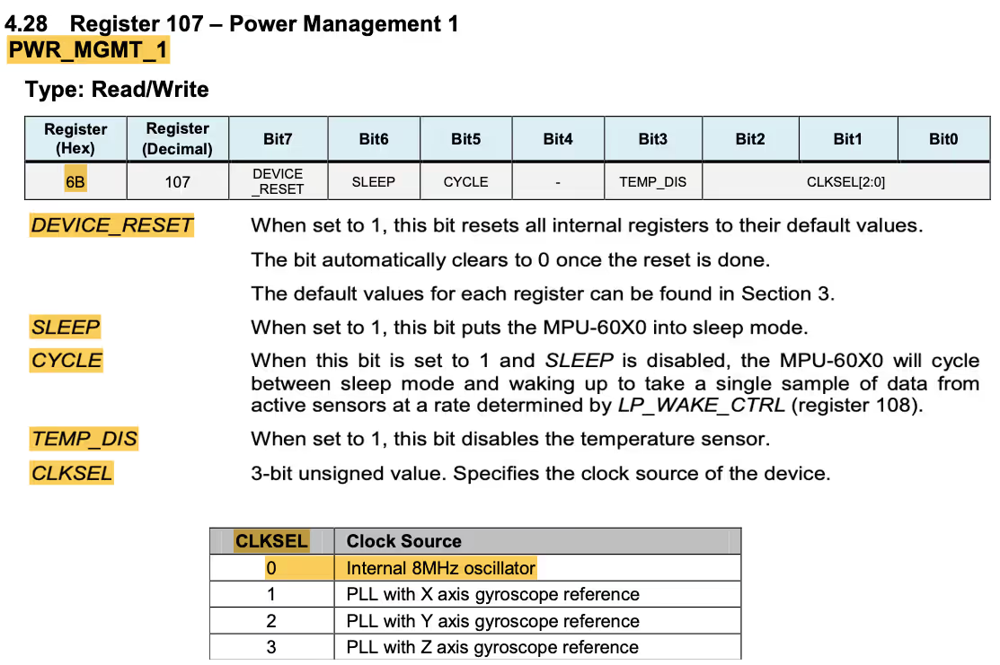

## 4. Sample Rate Divider - SMPRT_DIV

- Để tốc độ lấy mẫu là 1kHz, đặt **SMPLRT = 7**

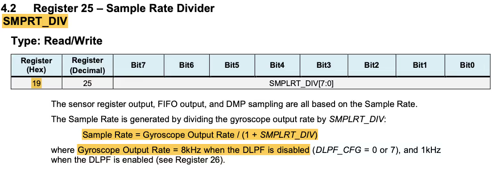

## 5. Configuration - CONFIG

- Có thể sử dụng thanh ghi “CONFIG (0x1A)” để cấu hình DLPF. Vì thanh ghi này được đặt lại về 0 theo mặc định, DLPF bị vô hiệu hóa và tốc độ đầu ra của con quay hồi chuyển được đặt thành 8KHz.

## 6. Gyroscope configuration & Accelerometer Configuration

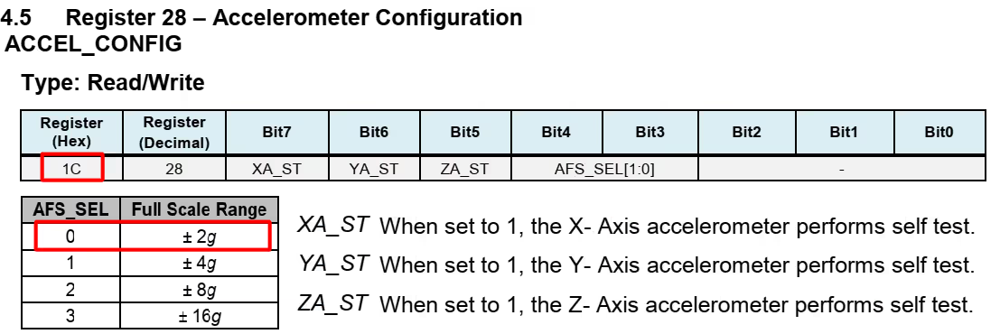

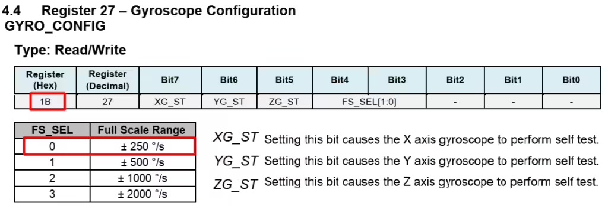

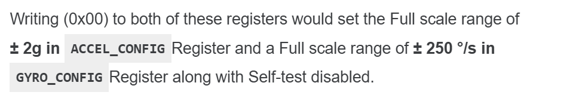

## 7. Accelerometer Measurements


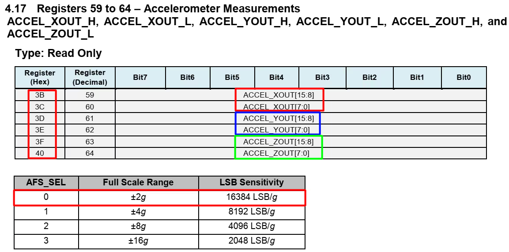

- Đọc 6 byte dữ liệu bắt đầu từ thanh ghi 0x3B. Kết hợp 2 bit để thành thanh ghi 16 bit

`ACCEL_X = (ACCEL_XOUT_H <<8) | ACCEL_XOUT_L`

Chia RAW cho 16384 để chuyển sang giá trị g

## 8. Gyroscope Measurement

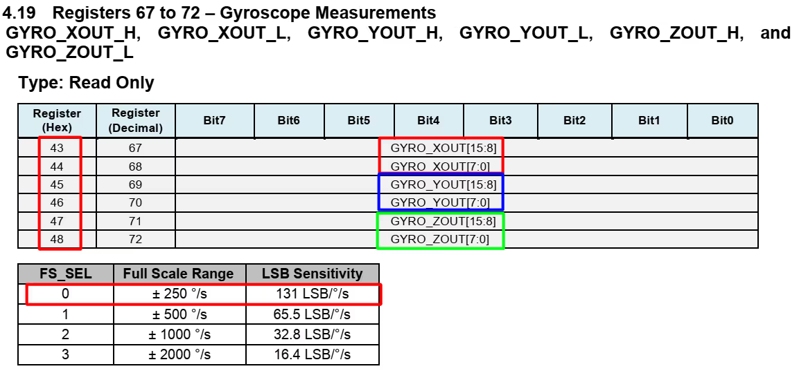

- Tương tự kết hợp L H để có 16 bit, chia RAW cho 131 để có được giá trị tính theo dps