# Ngắt phần 2

## 1. Ngắt ngoài

- Ngắt ngoài (EXTI - External Interrupt) -> ngắt xảy ra khi có sự kiện ở ngoại vi (sự thay đổi tín hiệu của các chân GPIO)

- Thực hiện yêu cầu ngắt nhanh, không cần CPU phải kiểm tra liên tục logic ở chân GPIO

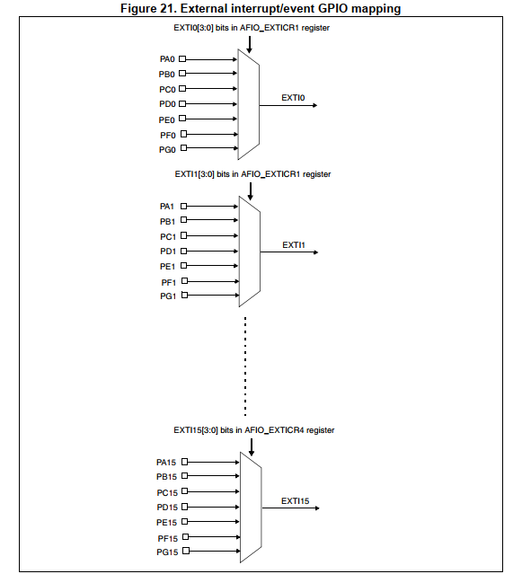

- 112 chân GPIO được chia thành 16 line ngắt ngoài

- Ở mỗi line ngắt chỉ nên sử dụng 1 chân để tránh xung đột gây lỗi

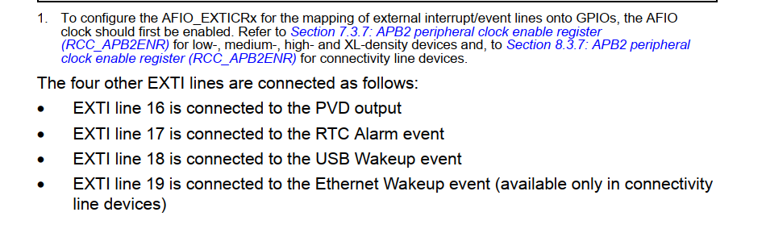

Các Line ngắt sẽ được phân vào các Vector ngắt tương ứng. Các Line ngắt của chip STM32F103 được phân bố vào các vector ngắt như sau:

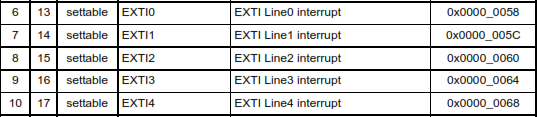
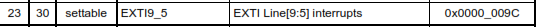
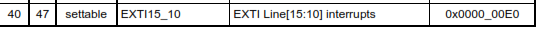


Các Line0, Line1, Line2, Line3, Line4 sẽ được phân vào các vector ngắt riêng biệt EXTI0, EXTI1, EXTI2, EXTI3, EXTI4, còn từ Line5->Line9 sẽ được phân vào vector ngắt EXTI9_5, Line10->Line15 được phân vào vecotr EXTI15_10.

### 1.1. Cấp clock

- Để sử dụng được ngắt ngoài cần bật Clock cho **AIFI** và các chân **GPIO** cần sử dụng
```c
void RCC_Config(){
	RCC_APB2PeriphClockCmd(RCC_APB2Periph_GPIOA, ENABLE);
	RCC_APB2PeriphClockCmd(RCC_APB2Periph_AFIO, ENABLE);
}

```

### 1.2. GPIO

- Đặt chân GPIO là input để nhận tín hiệu từ bên ngoài

- Cấu hình thêm trở kéo

```c
void GPIO_Config(){
GPIO_InitTypeDef GPIOInitStruct;
	//
	GPIOInitStruct.GPIO_Mode = GPIO_Mode_IPU;
	GPIOInitStruct.GPIO_Pin = GPIO_Pin_0;
	GPIOInitStruct.GPIO_Speed = GPIO_Speed_50MHz;
	GPIO_Init(GPIOA, &GPIOInitStruct);
}
```

### 1.3. Cấu hình EXTI

```c
	EXTIInitStruct.EXTI_Line = EXTI_Line0;
	EXTIInitStruct.EXTI_Mode = EXTI_Mode_Interrupt;
	EXTIInitStruct.EXTI_Trigger = EXTI_Trigger_Falling;
	EXTIInitStruct.EXTI_LineCmd = ENABLE;
	
	EXTI_Init(&EXTIInitStruct);

```

- Chọn đường line ngắt -> ví dụ 0 -> chọn chân ngắt là A0 hoặc các chân khác theo sơ đồ

- Mode là Interrupt

- **EXTI_Trigger_Falling**, gửi tín hiệu ngắt khi logic chân A0 từ 1->0


Hàm **GPIO_EXTILineConfig(uint8_t GPIO_PortSource, uint8_t GPIO_PinSource)** cấu hình chân ở chế độ sử dụng ngắt ngoài:

**GPIO_PortSource:** Chọn Port để sử dụng làm nguồn cho ngắt ngoài.

**GPIO_PinSource:** Chọn Pin để cấu hình.

### 1.4. Cấu hình bộ NVIC

- **NVIC (Nested vectored interrupt controller)**: bộ quản lý, xử lý yêu cầu ngắt. NVIC cho phép MCU **ngắt từ nhiều nguồn khác nhau**

- Ngắt ngoài nằm trong 1 phần của NVIC. Mỗi EXTI – interrupt/event controller có thể được lập trình chọn loại sự kiện/ ngắt, chọn cạnh lên, cạnh xuống hoặc cả 2, sắp xếp mức ưu tiên ngắt.

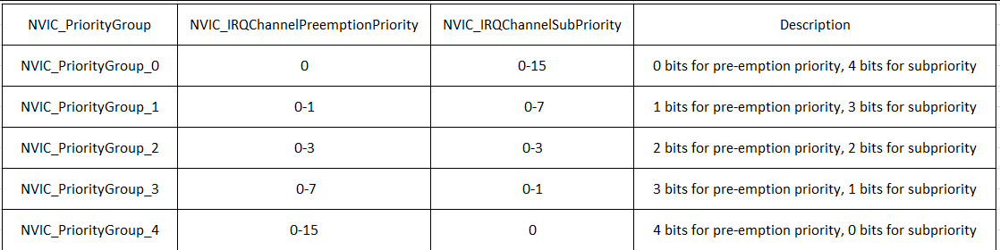

Có hai loại ưu tiên ngắt khác nhau trên MCU STM32F103C8T6 đó là Preemption Priorities và Sub Priorities:

– Mặc định thì ngắt nào có Preemtion Priority cao hơn thì sẽ được thực hiện trước.

– Khi nào 2 ngắt có cùng một mức Preemption Priority thì ngắt nào có Sub Priority cao hơn thì ngắt đó được thực hiện trước.

– Còn trường hợp 2 ngắt có cùng mức Preemption và Sub Priority luôn thì ngắt nào đến trước được thực hiện trước.

```c
	NVIC_InitTypeDef NVICInitStruct;
	NVIC_PriorityGroupConfig(NVIC_PriorityGroup_2);
	
	NVICInitStruct.NVIC_IRQChannel = EXTI0_IRQn;
	NVICInitStruct.NVIC_IRQChannelPreemptionPriority = 0x00;
	NVIC_InitStruct.NVIC_IRQChannelSubPriority = 0x00;
	NVICInitStruct.NVIC_IRQChannelCmd = ENABLE;
	
	NVIC_Init(&NVICInitStruct);

```

- **NVIC_IRQChannel**: cấu hình chọn kênh ngắt (EXTI, ngắt TIMER, ngắt truyền thông).

- **NVIC_IRQChannelPreemptionPriority:** Xác định mức độ ưu tiên Preemption Priority cho kênh ngắt.

- **NVIC_IRQChannelSubPriority:** Xác định mức độ ưu tiên phụ Subpriority cho kênh ngắt.

- **NVIC_IRQChannelCmd:** Cho phép ngắt.

### 1.5 Hàm phục vụ ngắt IRQ

- Ứng với mỗi line ngắt ngoài, có mỗi hàm phục vụ IRQ riêng 

	- **EXTIx_IRQHandler()** (x là line ngắt tương ứng).

	- Hàm **EXTI_GetITStatus(EXTI_Linex)**, Kiểm tra cờ ngắt của line x tương ứng. 

	- Hàm **EXTI_ClearITPendingBit(EXTI_Linex):** Xóa cờ ngắt ở line x.

Trong hàm phục vụ ngắt ngoài, chúng ta sẽ thực hiện:

- Kiểm tra ngắt đến từ line nào, có đúng là line cần thực thi hay không?

- Thực hiện các lệnh, các hàm.

- Xóa cờ ngắt ở line.

## 2. Timer

- Cấu hình Ngắt Timer	->	Cấu hình NVIC	-> Cho phép Timer chạy

### 2.1. Cấu hình ngắt Timer

- Vẫn cấu hình tại **Timebase_InitTypeDef**, riêng **Period** tự tính toán số lần Timer tràn để gửi tín hiệu ngắt xử lý công việc

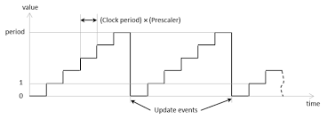

```c
void TIM_Config(){
   TIM_TimeBaseInitTypeDef TIM_TimeBaseInitStruct;

TIM_TimeBaseInitStruct.TIM_Prescaler = 7200-1;
TIM_TimeBaseInitStruct.TIM_Period = 10-1;
TIM_TimeBaseInitStruct.TIM_ClockDivision = TIM_CKD_DIV1;
TIM_TimeBaseInitStruct.TIM_CounterMode = TIM_CounterMode_Up;
TIM_TimeBaseInit(TIM2, &TIM_TimeBaseInitStruct);

TIM_ITConfig(TIM2, TIM_IT_Update, ENABLE);
TIM_Cmd(TIM2, ENABLE);
}

```

- **Prescaler**: bộ chia trước, xác định khoảng thời gian bao lâu thì period đến lên 1 lần (**0 đến 2 mũ 16**)

	- **Tck_cnt = 1/Fck_cnt**

	- **Fck_cnt = Fck_psc/(PSC (Prescaler) + 1)**

    - **Period**: Đếm bao nhiêu **Period** (thanh ghi ARR) thì Timer tràn -> update event

    - **Clock Division**: Chia tần số dao động của CPU (72MHz), chọn tần số dao động nhỏ hơn

	- **CounterMode**: thanh ghi ARR chọn đếm lên hay đếm xuống (thường set ARR = 0 và đếm lên)

### 2.2 Cấu hình bộ NVIC cho ngắt Timer

- Cấu hình tương tự như **EXTI**, chỉ đổi chỗ **NVIC.IRQChannel = TIM2_IRQn** (ngắt Timer 2)

### 2.3. Hàm xử lý ngắt

```c
uint16_t count;
void delay(int time){
	count = 0; 
	while(count < time){
	//Wait
}
}
void TIM2_IRQHandler()
{
if(TIM_GetITStatus(TIM2, TIM_IT_Update)){
		count++;

		// Clears the TIM2 interrupt pending bit
		TIM_ClearITPendingBit(TIM2, TIM_IT_Update);
}
}
```

## 3. Ngắt truyền thông (UART, I2C, SPI,...)

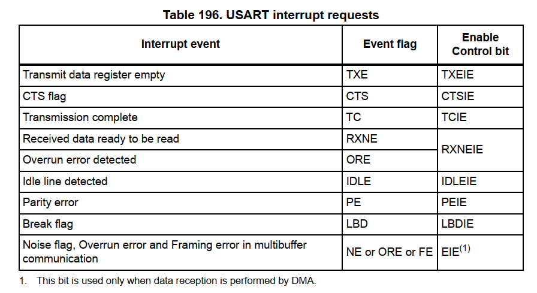
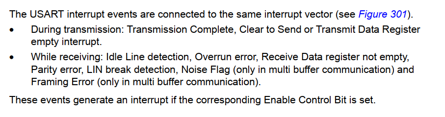

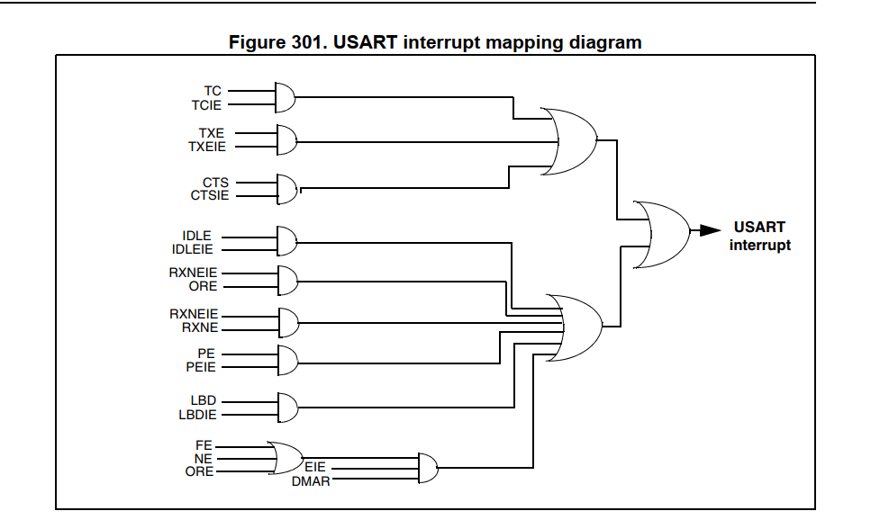
- Xảy ra khi có sự kiện truyền/nhận dữ liệu giữa MCU với các thiết bị bên ngoài hay với MCU.Sử dụng cho nhiều phương thức như SPI, I2C, UART,... nhằm đảm bảo việc truyền nhận chính xác. 

- Ví dụ: Khi bên truyền bắt đầu truyền thì bên nhận sẽ lập tức dừng chương trình hiện tại để thực hiện nhận dữ liệu từ bên truyền. Nhận xong sẽ tiếp tục thực hiện chương trình chính.

Hàm phục vụ ngắt UART được đặt tên : **USARTx_IRQHandler()**

```c
void USART1_IRQHandler()
{
	uint8_t data = 0x00;
	if(USART_GetITStatus(USART1, USART_IT_RXNE) != RESET){
		while(USART_GetFlagStatus(USART1, USART_FLAG_RXNE));
		data = USART_ReceiveData(USART1);
		if(USART_GetITStatus(USART1, USART_IT_TXE) == RESET){
			USART_SendData(USART1, data);
			while (USART_GetFlagStatus(USART1, USART_FLAG_TC) == RESET);
		}
	}
	USART_ClearITPendingBit (USART1, USART_IT_RXNE);
}
```
## 4. Cơ chế ngắt lồng nhau

- Địa chỉ được lưu vào Stack Pointer, dựa vào 2 thanh ghi LR (Link Register) và PC (Program Counter)

- **Thanh ghi Program Counter**: 

	- PC chứa địa chỉ **lệnh kế tiếp sẽ thực hiện**

	- Khi ngắt xảy ra, địa chỉ hiện tại trong PC (tức là lệnh đang thực thi) sẽ được lưu vào **Stack Pointer (SP)**

- **Thanh ghi LR (Link Register)**

	- LR thường lưu địa chỉ rở về sau khi **kết thúc một hàm hoặc ngắt**

	- Trong ngắt, LR chứa 1 giá trị đặc biệt gọi là **EXC_RETURN**, đùng để xác định hệ thống sẽ **quay lại chế độ nào sau khi xử ngắt**

- **Stack Pointer (SP)**

	- Khi CPU vào trình xử lý ngắt -> tự đọng đẩy một số thanh ghi vào stack thông qua SP

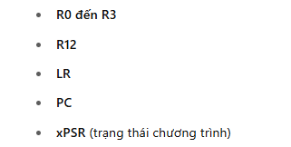


1. Giả sử **Ngắt A** đang được xử lý

2. Trong lúc đó, **Ngắt B** có mức ưu tiên xảy ra.

3. CPU tạm dừng ngắt A

4. CPU xử lý ngắt B

5. Khi kết thúc ngắt B

- Lấy lại LR, PC.... từ Stack, trở lại xử lý tiếp ngắt A

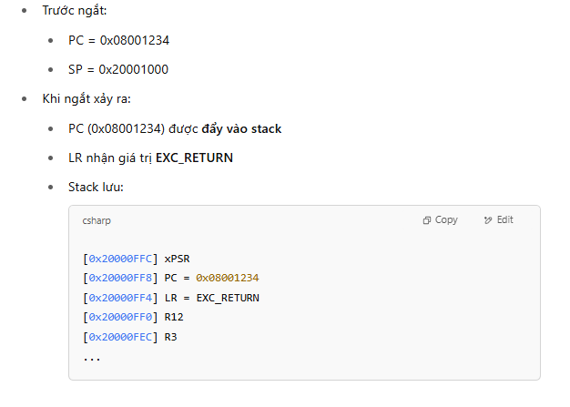

PC - Như vị trí chân bạn đang đứng hiện tại

LR - Như việc bạn cắm một lá cờ đánh dấu chỗ đứng cũ, để còn quay lại đúng chỗ sau khi làm việc khác