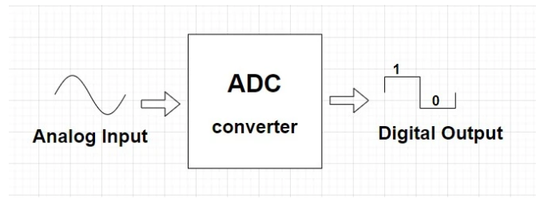
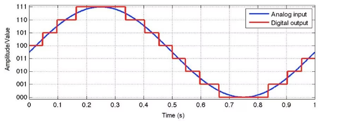
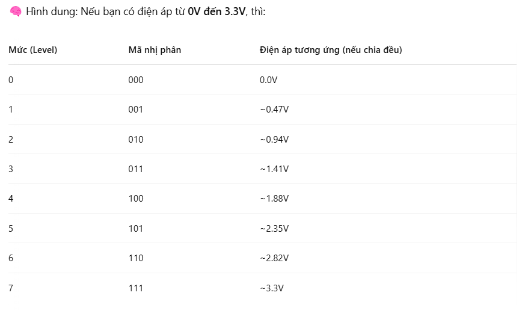
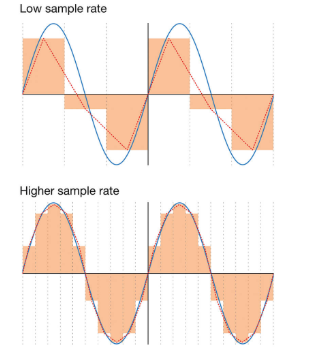
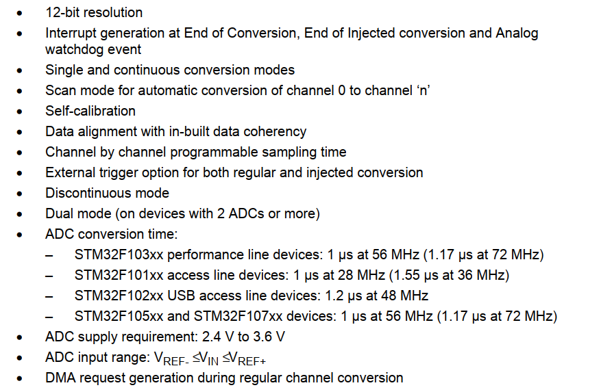
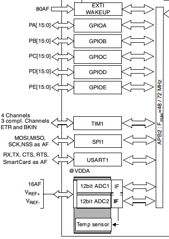
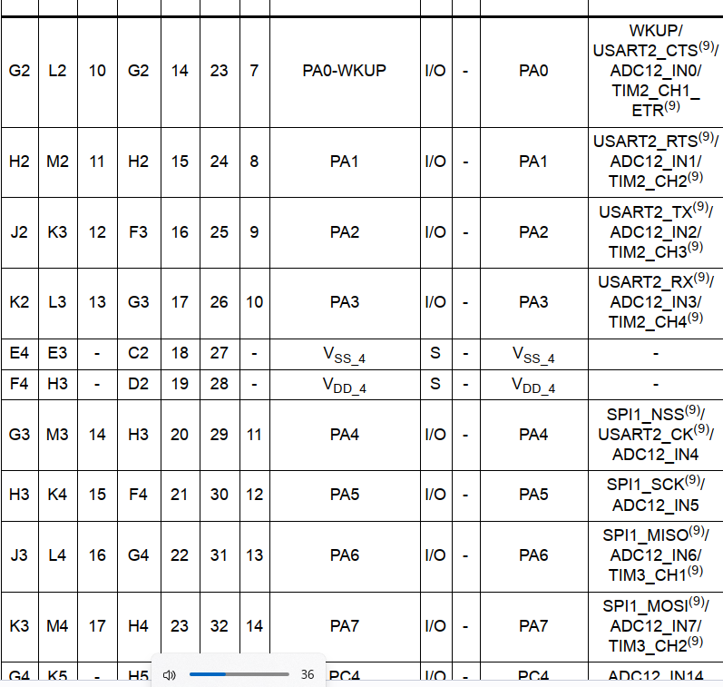
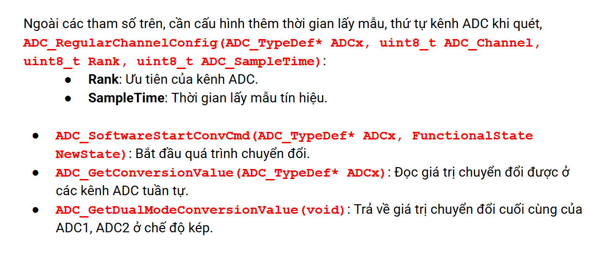

# ADC
## 1. Tổng quan

- Chuyển đổi tín hiệu dạng analog (nhiệt độ, độ ẩm) thành dạng digital để vdk xử lý được

- Về cơ bản, ADC hoạt động theo cách chia mức tín hiệu tương tự thành nhiều mức khác nhau. Các mức được biểu diễn bằng các bit nhị phân.

- Bằng việc so sánh giá trị điện áp mỗi lần lấy mẫu với 1 mức nhất định, ADC chuyển đổi tín hiệu tương tự và mã hóa các giá trị về giá trị nhị phân tương ứng.

## 2. Độ phân giải (Resolution)

- Chỉ số bit cần thiết để để chứa hết các mức giá trị số (digital) sau quá trình chuyển đổi. Độ phân giải càng cao thì dữ liệu chuyển đổi càng chính xác

- Ví dụ độ phân giải 3 bit

    - Có thể biểu diễn **2^3 = 8** giá trị đầu ra khác nhau ở đầu ra digital

- **Quá trình lượng tử hóa (quantization)**

    - Ví dụ với resolution = 3bit, lấy mẫu V tương tự = 1V -> trả về digital -> trả về mức 2 (010) hoặc 011 **Chọn mức gần nhất với giá trị analog**

## 3. Tần số lấy mẫu (sampling time)

- Thời gian giữa 2 lần digital hóa dữ liệu analog

- Càng cao thì dữ liệu càng chính xác

## 4. STM32F1

### 4.1. Tổng quan

- Giá trị điện áp đầu vào bộ ADC được cung cấp trên chân VDDA và thường lấy bằng giá trị cấp nguồn cho vi điều khiển VDD(+3V3). 

- Độ phân giải 12 bit, lưu trữ trong thanh ghi 16 bit

- Cung cấp các ngắt, DMA

 - Giả sử ta cần đo điện áp tối thiểu là 0V và tối đa là 3.3V, trong STM32 sẽ chia 0 → 3.3V thành 4096 khoảng giá trị (từ 0 → 4095, do 212 = 4096), giá trị đo được từ chân IO tương ứng với 0V sẽ là 0, tương ứng với 1.65V là 2047 và tương ứng 3.3V sẽ là 4095.

### 4.2. Các chế độ

- **Single Channel, single conversion mode** – Chế độ chuyển đổi đơn kênh, chuyển đổi 1 lần: Ở chế độ này, kênh đầu vào được lựa chọn sẽ được thực hiện chuyển đổi một lần, kết quả được lưu vào thanh ghi kết quả (ADC_DR), cờ báo kết thúc quá trình chuyển được được bật lên, yêu cầu ngắt sẽ được sinh ra nếu người dùng cấu hình cho phép ngắt.

- **Single-channel continuous conversion mode** – Chế độ chuyển đổi đơn kênh, chuyển đổi liên tục: Ở chế độ này kênh được chọn sẽ được chuyển đổi liên tục mà không cần sự can thiệp của CPU trong mỗi lần chuyển đổi. Chức năng DMA với mode circular nên được sử dụng trong chế độ này để giảm tải cho CPU.

- **Multichannel (scan), single conversion** – Chế độ chuyển đổi nhiều kênh, chuyển đổi 1 lần: Ở chế độ này, bộ ADC sẽ lần lượt chuyển đổi một chuỗi các kênh đầu vào đã được cấu hình từ trước, tối đa có thể chuyển đổi được 16 kênh. kết quả chuyển đổi của kênh cuối cùng sẽ được lưu vào thanh ghi ADC_DR, cờ báo kết thúc quá trình chuyển được được bật lên, yêu cầu ngắt sẽ được sinh ra nếu người dùng cấu hình cho phép ngắt. Chế độ này cần được kết hợp với tính năng DMA để có thể nhận đầy đủ kết quả chuyển đổi của các kênh. 

-  **Multichannel (scan) continuous conversion mode** – Chế đội chuyển đổi nhiều kênh, chuyển đổi liên tục: Ở chế độ này các kênh được chọn sẽ được chuyển đổi liên tục mà không cần sự can thiệp của CPU trong mỗi lần chuyển đổi. Chức năng DMA với mode circular kết hợp với việc tăng bộ nhớ tự động nên được sử dụng trong chế độ này để giảm tải cho CPU.

- **Injected Conversion:** Trong trường hợp nhiều kênh hoạt động. Khi kênh có mức độ ưu tiên cao hơn có thể tạo ra một Injected Trigger. Khi gặp Injected Trigger thì ngay lập tức kênh đang hoạt động bị ngưng lại để kênh được ưu tiên kia có thể hoạt động.

### 4.3. Sử dụng ADC

1. Cấp xung clock (ADC1, 2) nằm trên đường bus APB2, GPIOA chân nhận tín hiệu

2. Cấu hình GPIOA nhận tín hiệu từ bên ngoài

3. Cấu hình ADC

- **Mode: Independent**: Cấu hình chế độ hoạt động cho ADC là đơn kênh(Independent) hay đa kênh, ngoài ra còn có các chế độ ADC chuyển đổi tuần tự các kênh (regularly) hay chuyển đổi khi có kích hoạt từ phần mềm hay các tín hiệu khác (injected).

- **ADC_NbrOfChannel:** Chọn kênh ADC để cấu hình, có 16 kênh tương ứng với 16 chân IO cấu hình sẵn (xem datasheet) và 2 kênh Vref và TempSensor để quy chiếu điện áp, đo điện áp Pin vv,.

- **ADC_ContinuousConvMode:** Cấu hình bộ ADC có chuyển đổi liên tục hay không, Enable để cấu hình ADC  chuyển đổi lien tục, nếu cấu hình Disable, ta phải gọi lại lệnh đọc ADC để bắt đầu quá trình chuyển đổi. 

- **ADC_ExternalTrigConv:** Enable để sử dụng tín hiệu ngoài để kích hoạt ADC, Disable nếu không sử dụng.

- **ADC_ScanConvMode:** Cấu hình chế độ quét ADC lần lượt từng kênh. Enable nếu sử dụng chế độ quét này.

- **ADC_DataAlign:** Cấu hình căn lề cho data. Vì bộ ADC xuất ra giá trị 12bit, được lưu vào biến 16 hoặc 32 bit nên phải căn lề các bit về trái hoặc phải. Thường thì để **right**

