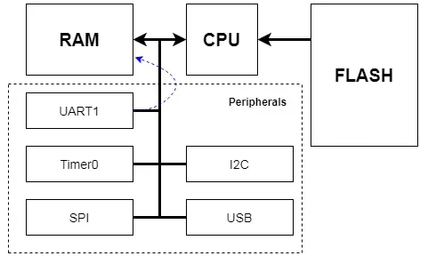
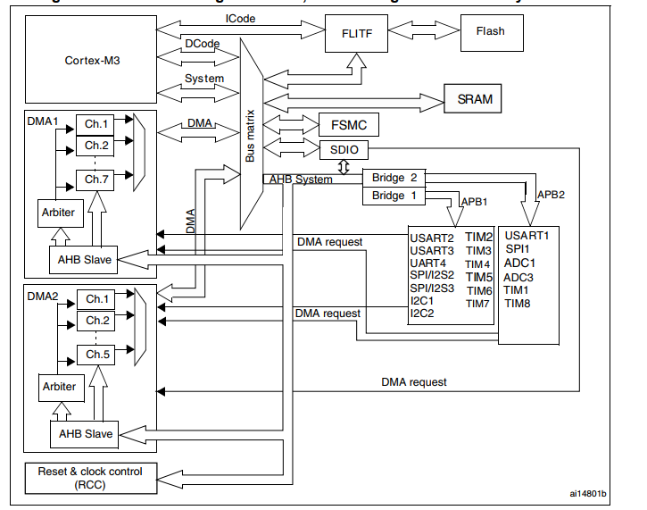

# DMA

## 1. Tổng quan

- Truyền dữ liệu tốc độ cao giữa ngoại vi và bộ nhớ hoặc bộ nhớ - bộ nhớ

- Truyền dữ liệu trực tiếp từ các ngoại vi vào RAM không thông qua CPU

- CPU lấy lệnh chương trình firmware từ Flash để xử lý

- CPU đọc/ ghi dữ liệu từ các ngoại vi thông qua đường bus ngoại vi

- Lưu dữ liệu vừa đọc vào RAM, giao tiếp với RAM (đọc/ ghi dữ liệu) thông qua memory bus

Ví dụ luồng hoạt động:

- CPU cấu hình DMA hoạt động

- ADC1 hoàn tất việc chuyển đổi mẫu -> tạo DMA request

- Kênh DMA (vd DMA1) nhận request

- DMA sử dụng AHB system để chuyển dữ liệu từ ADC1 -> SRAM  (Lấy dữ liệu từ SRAM thông qua **Bus Matrix** <-> Đi qua các đường bus ngoại vi <-> Truy cập thanh ghi của ngoại vi)

- Khi quá trình kết thúc, DMA báo ngắt cho CPU để dừng can thiệp