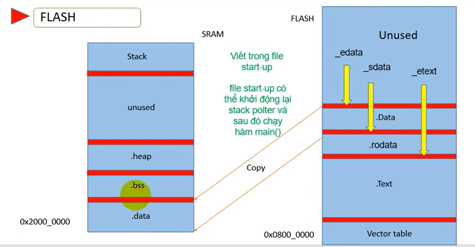

# Flash

**RAM (Random Access Memory)** là một loại bộ nhớ cho phép truy-xuất ngẫu nhiên đến một vị trí bất kỳ trong bộ nhớ thông qua địa chỉ bộ nhớ. RAM có tốc độ đọc/ghi nhanh nhưng dữ liệu sẽ mất bị mất khi ngưng cấp nguồn. RAM thường được dùng để lưu trữ tạm thời dữ liệu và các lệnh đang được thực thi.

**FLASH** là một bộ nhớ có thể xoá và lập trình. FLASH có tốc độ ghi chậm nhưng đọc nhanh và nó không bị mất dữ liệu khi ngưng cấp nguồn. FLASH được chia nhỏ thành các **Bank**, mỗi bank gồm một hoặc nhiều **Page**, mỗi page có kích thước là 1Kb. FLASH giới hạn số lần xoá/ghi và chỉ có thể ghi theo khối 2/4 byte. Vì FLASH không thể đẩy bit 1 xuống 0 nên **trước khi ghi thì phải xoá FLASH trước**. FLASH thường được dùng để lưu chương trình.

**Option Bytes:** **Vùng byte tùy chọn chứa một loạt cờ bit** có thể được sử dụng để định cấu hình một số khía cạnh của MCU (như bảo vệ đọc ghi FLASH, v.v…)

**System Memory:** Là vùng **ROM dành riêng cho Bootloader**. Những Bootloader này có thể được sử dụng để tải code từ một số thiết bị ngoại vi, bao gồm USART, USB và CAN Bus.
## 1. Tổng quan

Một chương trình:Code,Data

- Code sẽ được lưu trữ ở phần .text trong FLASH

- Data sẽ được lưu trữ trong FLASH hoặc RAM

- Ví dụ nếu là data const thì lưu trữ trong FLASH vì lưu trữ trong RAM không có ý nghĩa
FLASH mình mặc định xem là bộ nhớ chỉ ghi

- Ram là đọc ghi

- phần .rodata ta cũng sẽ không lưu trữ RAM, vì rodata lưu trữ hằng số của chương trình
Các biến bình thường sẽ lưu trong bộ nhớ đọc ghi được vì nó có thể thay đổi trong lúc runtime

- Quá trình boot từ Flash qua RAM

## 2. ND

Địa chỉ bộ nhớ Flash bắt đầu từ 0x0000.0000, nhưng trong Vi điều khiển STM32, vùng nhớ code được lưu từ địa chỉ 0x0800.0000, khi chúng ta nạp xuống, nó sẽ mặc định nạp chương trình từ địa chỉ này, với MSP - Main Stack Pointer ở địa chỉ 0x0800.0000 và Vector Table bắt đầu từ địa chỉ 0x0800.0004 (Reset_Handler).
